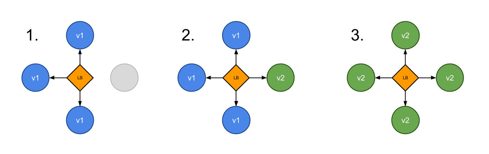

## 重建
停止旧版本部署新版本

## 滚动更新
批量滚动更新方式发布新版本

## 蓝绿
新版本与旧版本一起存在，然后切换流量

## 金丝雀
将新版本面向一部分用户发布，然后继续全量发布

金丝雀部署是让部分用户访问到新版本应用，在`Kubernetes`中，可以使用两个具有相同`Pod`标签的`Deployment`来实现金丝雀部署。新版本的副本和旧版本的一起发布。在一段时间后如果没有检测到错误，则可以割接流量到新版本并删除旧版本的应用。

在下面的例子中，我们使用`ingress-nginx`来实现一个金丝雀发布

1. 2个副本的v1应用提供服务
v1资源清单`ingress-myhttp-v1.yml`
```yaml
apiVersion: apps/v1
kind: Deployment
metadata:
  name: myhttp-v1-deployment
  labels:
    app: myhttp-v1
spec:
  replicas: 2
  selector:
    matchLabels:
      app: myhttp-v1
  template:
    metadata:
      labels:
        app: myhttp-v1
    spec:
      containers:
      - name: myhttp
        image: 172.188.3.24:8000/library/myhttp:v1
        ports:
        - containerPort: 80
---
apiVersion: v1
kind: Service
metadata:
  name: myhttp-v1-service
spec:
  selector:
    app: myhttp-v1
  ports:
    - protocol: TCP
      port: 80
      targetPort: 80
---
apiVersion: extensions/v1beta1
kind: Ingress
metadata:
  name: ingress-myhttp-v1
  labels:
    app: ingress-myhttp-v1
  annotations:
    kubernetes.io/ingress.class: "nginx"
    nginx.ingress.kubernetes.io/use-regex: "true"
spec:
  rules:
    - host: www.myhttp.com
      http:
        paths:
          - path: /
            backend:
              serviceName: myhttp-v1-service
              servicePort: 80
```

2. 2个副本的v2应用提供服务（权重设置50%）
v2资源清单`ingress-myhttp-v2.yml`，设置权重50%
```yaml
apiVersion: apps/v1
kind: Deployment
metadata:
  name: myhttp-v2-deployment
  labels:
    app: myhttp-v2
spec:
  replicas: 2
  selector:
    matchLabels:
      app: myhttp-v2
  template:
    metadata:
      labels:
        app: myhttp-v2
    spec:
      containers:
      - name: myhttp
        image: 172.188.3.24:8000/library/myhttp:v2
        ports:
        - containerPort: 80
---
apiVersion: v1
kind: Service
metadata:
  name: myhttp-v2-service
spec:
  selector:
    app: myhttp-v2
  ports:
    - protocol: TCP
      port: 80
      targetPort: 80
---
apiVersion: extensions/v1beta1
kind: Ingress
metadata:
  name: ingress-myhttp-v2
  labels:
    app: ingress-myhttp-v2
  annotations:
    kubernetes.io/ingress.class: "nginx"
    nginx.ingress.kubernetes.io/use-regex: "true"
    nginx.ingress.kubernetes.io/canary: "true"
    nginx.ingress.kubernetes.io/canary-weight: "50"
spec:
  rules:
    - host: www.myhttp.com
      http:
        paths:
          - path: /
            backend:
              serviceName: myhttp-v2-service
              servicePort: 80
```

3. 验证
```shell
➜  ~ for i in `seq 1 10`;do
curl 'http://www.myhttp.com' -x '172.188.2.87:80'
echo
done
{"status": "SUCCESS", "version": "v2", "hostname": "myhttp-v2-deployment-84dfdfbcd8-55gzd", "IP": "10.244.2.109"}
{"status": "SUCCESS", "data": "hello from server"}
{"status": "SUCCESS", "data": "hello from server"}
{"status": "SUCCESS", "version": "v2", "hostname": "myhttp-v2-deployment-84dfdfbcd8-55gzd", "IP": "10.244.2.109"}
{"status": "SUCCESS", "version": "v2", "hostname": "myhttp-v2-deployment-84dfdfbcd8-55gzd", "IP": "10.244.2.109"}
{"status": "SUCCESS", "data": "hello from server"}
{"status": "SUCCESS", "version": "v2", "hostname": "myhttp-v2-deployment-84dfdfbcd8-t74p2", "IP": "10.244.1.106"}
{"status": "SUCCESS", "data": "hello from server"}
{"status": "SUCCESS", "data": "hello from server"}
{"status": "SUCCESS", "data": "hello from server"}
```

4. 流量全部割接到v2应用上
流量割接，修改v2权重为100即可`nginx.ingress.kubernetes.io/canary-weight: "100"`

## A/B测试
以精确的方式（HTTP 头、cookie、权重等）向部分用户发布新版本。A/B测实际上是一种基于数据统计做出业务决策的技术。在Kubernetes 中并不原生支持，需要额外的一些高级组件来完成改设置（比如Istio、Linkerd、Traefik、或者自定义 Nginx/Haproxy 等）