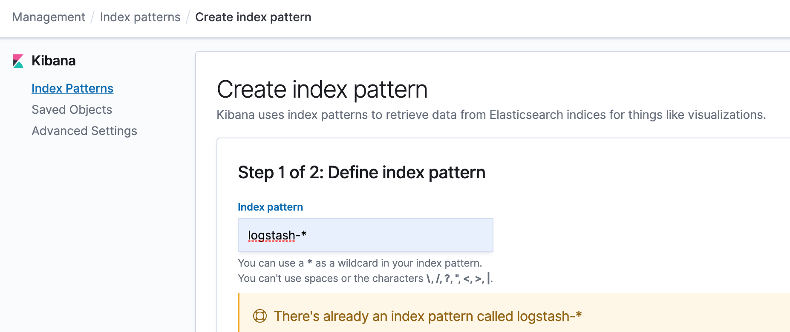
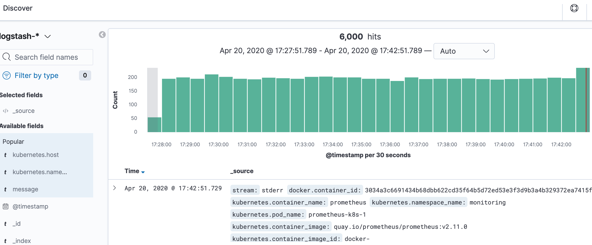

## 简介

### 收集方式
`kubernetes`集群本身不提供日志收集的解决方案，一般来说主要有三种方案：
1. 在节点上运行一个agent（DaemonSet）来收集日志
2. 在Pod中包含一个sidecar容器来收集应用日志
3. 直接在应用程序中将日志信息推送到采集后端

参考：`https://www.qikqiak.com/post/kubernetes-logs-architecture/`

### 推荐方案
`kubernetes`中比较流行的日志收集解决方案是`Elasticsearch`、`Fluentd`和`Kibana`（EFK）技术栈，也是官方现在比较推荐的一种方案

## 部署

### 前提
下面的案例使用helm来部署EFK, **elasticsearch的版本必须和kibana的版本一致**

| CHART | APP VERSION |
| :---: | :---------: |
| elasticsearch-11.0.18 | 7.6.2 |
| fluentd-elasticsearch-6.2.4 | 3.0.0 |
| kibana-5.0.14 | 7.6.2 |

创建命名空间：

`kubectl create ns efk`

### elasticsearch

添加bitnami repo：

`helm repo add bitnami https://charts.bitnami.com/bitnami`

下载package：

`helm fetch bitnami/elasticsearch --version 11.0.18 --untar`

修改参数：
+ 使用存储卷

```yaml
persistence:
  enabled: true
  storageClass: "managed-nfs-storage"
```

安装：

`helm install es-release bitnami/elasticsearch --version 11.0.18 -n efk -f elasticsearch/values.yaml`

```shell
NAME: es-release
LAST DEPLOYED: Fri Apr 17 18:06:41 2020
NAMESPACE: efk
STATUS: deployed
REVISION: 1
TEST SUITE: None
NOTES:
-------------------------------------------------------------------------------
 WARNING

    Elasticsearch requires some changes in the kernel of the host machine to
    work as expected. If those values are not set in the underlying operating
    system, the ES containers fail to boot with ERROR messages.

    More information about these requirements can be found in the links below:

      https://www.elastic.co/guide/en/elasticsearch/reference/current/file-descriptors.html
      https://www.elastic.co/guide/en/elasticsearch/reference/current/vm-max-map-count.html

    This chart uses a privileged initContainer to change those settings in the Kernel
    by running: sysctl -w vm.max_map_count=262144 && sysctl -w fs.file-max=65536

** Please be patient while the chart is being deployed **

  Elasticsearch can be accessed within the cluster on port 9200 at es-release-elasticsearch-coordinating-only.efk.svc.cluster.local

  To access from outside the cluster execute the following commands:

    export NODE_PORT=$(kubectl get --namespace efk -o jsonpath="{.spec.ports[0].nodePort}" services es-release-elasticsearch-coordinating-only)
    export NODE_IP=$(kubectl get nodes --namespace efk -o jsonpath="{.items[0].status.addresses[0].address}")
    curl http://$NODE_IP:$NODE_PORT/
```

测试：
+ 测试端口
+ 查看节点状态

```shell
[root@master ~]# kubectl run cirros --rm -it --image=cirros  -- /bin/sh
kubectl run --generator=deployment/apps.v1 is DEPRECATED and will be removed in a future version. Use kubectl run --generator=run-pod/v1 or kubectl create instead.
If you don't see a command prompt, try pressing enter.
/ # curl es-release-elasticsearch-coordinating-only.efk.svc.cluster.local:9200
{
  "name" : "es-release-elasticsearch-coordinating-only-868b99f9b-szbcm",
  "cluster_name" : "elastic",
  "cluster_uuid" : "o9QJY50SQluG3dyMF5WmSw",
  "version" : {
    "number" : "7.6.2",
    "build_flavor" : "oss",
    "build_type" : "tar",
    "build_hash" : "ef48eb35cf30adf4db14086e8aabd07ef6fb113f",
    "build_date" : "2020-03-26T06:34:37.794943Z",
    "build_snapshot" : false,
    "lucene_version" : "8.4.0",
    "minimum_wire_compatibility_version" : "6.8.0",
    "minimum_index_compatibility_version" : "6.0.0-beta1"
  },
  "tagline" : "You Know, for Search"
}
/ # curl es-release-elasticsearch-coordinating-only.efk.svc.cluster.local:9200/_cat/nodes?v
ip          heap.percent ram.percent cpu load_1m load_5m load_15m node.role master name
10.244.1.86           52          25   1    0.01    0.09     0.13 d         -      es-release-elasticsearch-data-1
10.244.1.85           41          25   1    0.01    0.09     0.13 m         *      es-release-elasticsearch-master-1
10.244.2.86           50          27   1    0.15    0.19     0.22 d         -      es-release-elasticsearch-data-0
10.244.2.87           37          27   1    0.15    0.19     0.22 m         -      es-release-elasticsearch-master-0
10.244.2.85           53          27   1    0.15    0.19     0.22 -         -      es-release-elasticsearch-coordinating-only-868b99f9b-szbcm
10.244.1.84           44          25   1    0.01    0.09     0.13 -         -      es-release-elasticsearch-coordinating-only-868b99f9b-nmmzp
```

### fluentd
这里使用`DaemonSet`的方式部署fluentd

添加kiwigrid repo：

`helm repo add kiwigrid https://kiwigrid.github.io`

下载package：

`helm fetch kiwigrid/fluentd-elasticsearch --version 3.0.0 --untar`

修改参数：
+ 修改elasticsearch host 
+ 允许收集master节点的pod日志

```yaml
elasticsearch:
  host: "es-release-elasticsearch-coordinating-only.efk.svc.cluster.local"

tolerations:
   - key: node-role.kubernetes.io/master
     operator: Exists
     effect: NoSchedule
```

安装：

`helm install fe-release --namespace efk -f fluentd-elasticsearch/values.yaml kiwigrid/fluentd-elasticsearch --version 3.0.0`

```shell
NAME: fe-release
LAST DEPLOYED: Fri Apr 17 18:24:22 2020
NAMESPACE: efk
STATUS: deployed
REVISION: 1
TEST SUITE: None
NOTES:
1. To verify that Fluentd has started, run:

  kubectl --namespace=efk get pods -l "app.kubernetes.io/name=fluentd-elasticsearch,app.kubernetes.io/instance=fe-release"

THIS APPLICATION CAPTURES ALL CONSOLE OUTPUT AND FORWARDS IT TO elasticsearch . Anything that might be identifying,
including things like IP addresses, container images, and object names will NOT be anonymized.
2. Get the application URL by running these commands:
  export POD_NAME=$(kubectl get pods --namespace efk -l "app.kubernetes.io/name=fluentd-elasticsearch,app.kubernetes.io/instance=fe-release" -o jsonpath="{.items[0].metadata.name}")
  echo "Visit http://127.0.0.1:8080 to use your application"
  kubectl port-forward $POD_NAME 8080:80
```

测试：
+ 查看生成的index

```shell
[root@master ~]# kubectl run cirros --rm -it --image=cirros  -- /bin/sh
kubectl run --generator=deployment/apps.v1 is DEPRECATED and will be removed in a future version. Use kubectl run --generator=run-pod/v1 or kubectl create instead.
If you don't see a command prompt, try pressing enter.
/ # curl es-release-elasticsearch-coordinating-only.efk.svc.cluster.local:9200/_cat/indices?v
health status index               uuid                   pri rep docs.count docs.deleted store.size pri.store.size
green  open   logstash-2020.04.17 FgvPHuA0R-yf-5y3otDNnQ   1   1     326045            0    175.8mb           88mb
green  open   .kibana_1           5G0PnvrUSbmKyLdCzvO04w   1   1          9            2      146kb           73kb
```

### kibana

下载package：

`helm fetch bitnami/kibana --version 5.0.14 --untar`

修改参数：
+ 使用存储卷
+ 使用NodePort发布服务
+ 修改elasticsearch host

```yaml
persistence:
  enabled: true
  storageClass: "managed-nfs-storage"

service:
  port: 80
  type: NodePort

elasticsearch:
  hosts:
  - es-release-elasticsearch-coordinating-only.efk.svc.cluster.local
  port: 9200
```

安装：

`helm install kb-release bitnami/kibana --version 5.0.14 -n efk -f kibana/values.yaml`

```shell
NAME: kb-release
LAST DEPLOYED: Fri Apr 17 19:00:52 2020
NAMESPACE: efk
STATUS: deployed
REVISION: 1
NOTES:
1. Get the application URL by running these commands:
  export NODE_PORT=$(kubectl get --namespace efk -o jsonpath="{.spec.ports[0].nodePort}" services kb-release-kibana)
  export NODE_IP=$(kubectl get nodes --namespace efk -o jsonpath="{.items[0].status.addresses[0].address}")
  echo http://$NODE_IP:$NODE_PORT

WARNING: Kibana is externally accessible from the cluster but the dashboard does not contain authentication mechanisms. Make sure you follow the authentication guidelines in your Elastic stack.
+info https://www.elastic.co/guide/en/elastic-stack-overview/current/setting-up-authentication.html
```

添加index：



页面展示：

