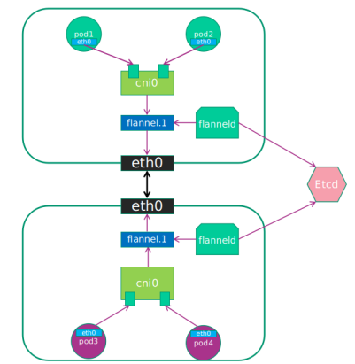

## Flannel
让集群中节点创建的容器都具有全集群唯一的虚拟IP地址。而且它还能在这些IP地址之间建立一个
覆盖网络（Overlay Network），通过这个覆盖网络将数据包原封不动的在各容器之间传递
**同一Node的不同Pod之间通过Docker0访问**

ETCD之Flannel提供说明：
1. 存储管理Flannel可分配的IP地址段资源
2. 监控ETCD中每个Pod的实际地址，并在内存中建立维护Pod节点路由表