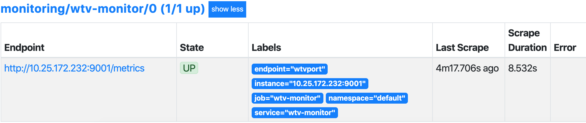

## 简介

### 前提

这里我们使用`Prometheus`监控Kubernetes集群状态，配置`Prometheus`的成本非常高，而且也非常麻烦。如果我们还要考虑`Prometheus`、`AlertManager`这些组件服务本身的高可用的话，成本就更高了。因此我们可以使用另外一种更加高级的方式来部署`Prometheus`：`Operator`框架

### Operator

`Operator`是由CoreOS开发的，用来扩展Kubernetes API，特定的应用程序控制器，它用来创建、配置和管理复杂的有状态应用，如数据库、缓存和监控系统。`Operator`基于Kubernetes的资源和控制器概念之上构建，但同时又包含了应用程序特定的领域知识。创建`Operator`的关键是CRD（自定义资源）的设计。

**架构图**


## 安装

### helm安装

```shell
helm repo add stable https://kubernetes-charts.storage.googleapis.com/
kubectl create namespace monitoring
helm install prometheus-operator --namespace monitoring stable/prometheus-operator
```

### 源码安装

版本：`v0.3.0`

```shell
wget https://github.com/coreos/kube-prometheus/archive/v0.3.0.tar.gz
tar -zxv -f v0.3.0.tar.gz; cd kube-prometheus-0.3.0
kubectl apply -f manifests/setup
kubectl apply -f manifests
```

部署完成后，会创建一个monitoring的namespace，所有的资源对象都将部署在这个命名空间下面。

`CRD`

```shell
[root@master manifests]# kubectl get crd | grep coreos
alertmanagers.monitoring.coreos.com     2020-03-08T15:50:21Z
podmonitors.monitoring.coreos.com       2020-03-08T15:50:21Z
prometheuses.monitoring.coreos.com      2020-03-08T15:50:22Z
prometheusrules.monitoring.coreos.com   2020-03-08T15:50:22Z
servicemonitors.monitoring.coreos.com   2020-03-08T15:50:22Z
```

`POD` alertmanager和prometheus是用StatefulSet控制器管理的，其中还有一个比较核心的Pod prometheus-operator，用来控制其他资源对象和监听对象变化

```shell
[root@master manifests]# kubectl get pod -n monitoring
NAME                                  READY   STATUS    RESTARTS   AGE
alertmanager-main-0                   2/2     Running   0          16h
alertmanager-main-1                   2/2     Running   0          16h
alertmanager-main-2                   2/2     Running   0          16h
grafana-58dc7468d7-7nx9d              1/1     Running   0          2d11h
kube-state-metrics-78b46c84d8-hc8cm   3/3     Running   0          2d11h
node-exporter-2sgf6                   2/2     Running   0          2d11h
node-exporter-66sh6                   2/2     Running   0          2d11h
node-exporter-74mx4                   2/2     Running   0          2d11h
prometheus-adapter-5cd5798d96-x6rcs   1/1     Running   0          2d11h
prometheus-k8s-0                      3/3     Running   1          44h
prometheus-k8s-1                      3/3     Running   1          44h
prometheus-operator-99dccdc56-x6htc   1/1     Running   0          2d11h
```

`SVC`

```shell
[root@master manifests]# kubectl get svc -n monitoring
NAME                    TYPE        CLUSTER-IP       EXTERNAL-IP   PORT(S)                      AGE
alertmanager-main       ClusterIP   10.101.142.157   <none>        9093/TCP                     2d11h
alertmanager-operated   ClusterIP   None             <none>        9093/TCP,9094/TCP,9094/UDP   2d11h
grafana                 ClusterIP   10.98.84.141     <none>        3000/TCP                     2d11h
kube-state-metrics      ClusterIP   None             <none>        8443/TCP,9443/TCP            2d11h
node-exporter           ClusterIP   None             <none>        9100/TCP                     2d11h
prometheus-adapter      ClusterIP   10.106.199.108   <none>        443/TCP                      2d11h
prometheus-k8s          ClusterIP   10.109.190.166   <none>        9090/TCP                     2d11h
prometheus-operated     ClusterIP   None             <none>        9090/TCP                     2d11h
prometheus-operator     ClusterIP   None             <none>        8080/TCP                     2d11h
```

## 配置
**以下配置是基于源码安装**

### k8s组件监控
`Operator`默认监控了`Kubernetes`的大多数组件，但有些组件没有监控到，比如`kube-scheduler`、`kube-controller-manager`。这就跟ServiceMonitor里面的定义有关了

#### kube-scheduler

*prometheus-serviceMonitorKubeScheduler.yaml里面定义的svc没有创建*

手动创建svc
`prometheus-kubeSchedulerService.yaml`

```yaml
apiVersion: v1
kind: Service
metadata:
  namespace: kube-system
  name: kube-scheduler
  labels:
    k8s-app: kube-scheduler
spec:
  selector:
    component: kube-scheduler
  ports:
  - name: http-metrics
    port: 10251
    targetPort: 10251
    protocol: TCP
```

```shell
kubectl apply -f prometheus-kubeSchedulerService.yaml
```

*现在可以看到这个target，但是抓取数据出错，这个错误是因为我们集群是使用`kubeadm`搭建的，其中`kube-scheduler`默认是绑定在127.0.0.1上面的，而上面我们这个地方是想通过节点的IP去访问，所以访问被拒绝了，我们只要把`kube-scheduler`绑定的地址更改成0.0.0.0即可满足要求，由于`kube-scheduler`是以静态`Pod`的形式运行在集群中的，所以我们只需要更改静态`Pod`目录下面对应的YAML文件配置即可*

修改静态Pod配置
`/etc/kubernetes/manifests/kube-scheduler.yaml`

```yaml
spec:
  containers:
  - command:
    - --bind-address=0.0.0.0
```

#### kube-controller-manager

*异常原因和解决方法同上*

手动创建svc

`prometheus-KubeControllerManagerService.yaml`

```yaml
apiVersion: v1
kind: Service
metadata:
  namespace: kube-system
  name: kube-controller-manager
  labels:
    k8s-app: kube-controller-manager
spec:
  selector:
    component: kube-controller-manager
  ports:
  - name: http-metrics
    port: 10252
    targetPort: 10252
    protocol: TCP
```

```shell
kubectl apply -f prometheus-KubeControllerManagerService.yaml
```

修改静态Pod配置
`/etc/kubernetes/manifests/kube-controller-manager.yaml`

```yaml
spec:
  containers:
  - command:
    - --bind-address=0.0.0.0
```

### grafana

默认已经配置好，可使用默认账号、密码`admin:admin`登录查看

### 数据持久化

Pod `prometheus`和`alertmanager`默认用的`emptyDir`存储，没有做数据持久化。Pod重启后数据就丢失了

配置数据持久化

1. prometheus

`prometheus-prometheus.yaml`

添加
```yaml
  storage:
    volumeClaimTemplate:
      spec:
        storageClassName: managed-nfs-storage
        resources:
          requests:
            storage: 1Gi
```

验证
```shell
[root@master ~]# kubectl get pvc -n monitoring
NAME                                 STATUS   VOLUME                                     CAPACITY   ACCESS MODES   STORAGECLASS          AGE
prometheus-k8s-db-prometheus-k8s-0   Bound    pvc-1b09ac85-c23f-4511-a9e1-015491647aeb   1Gi        RWO            managed-nfs-storage   3d8h
prometheus-k8s-db-prometheus-k8s-1   Bound    pvc-54203f65-a8b8-4f87-af9b-a11f5e52545c   1Gi        RWO            managed-nfs-storage   3d8h
[root@master ~]# kubectl get pv
NAME                                       CAPACITY   ACCESS MODES   RECLAIM POLICY   STATUS   CLAIM                                           STORAGECLASS          REASON   AGE
pvc-1b09ac85-c23f-4511-a9e1-015491647aeb   1Gi        RWO            Delete           Bound    monitoring/prometheus-k8s-db-prometheus-k8s-0   managed-nfs-storage            3d8h
pvc-54203f65-a8b8-4f87-af9b-a11f5e52545c   1Gi        RWO            Delete           Bound    monitoring/prometheus-k8s-db-prometheus-k8s-1   managed-nfs-storage            3d8h
```

### 告警配置

AlertManager配置各种告警收发器

Service `alertmanager-main`上的status页面可以看到`AlertManager`的配置信息

Config
```yaml
global:
  resolve_timeout: 5m
  http_config: {}
  smtp_hello: localhost
  smtp_require_tls: true
  pagerduty_url: https://events.pagerduty.com/v2/enqueue
  hipchat_api_url: https://api.hipchat.com/
  opsgenie_api_url: https://api.opsgenie.com/
  wechat_api_url: https://qyapi.weixin.qq.com/cgi-bin/
  victorops_api_url: https://alert.victorops.com/integrations/generic/20131114/alert/
route:
  receiver: "null"
  group_by:
  - job
  routes:
  - receiver: "null"
    match:
      alertname: Watchdog
  group_wait: 30s
  group_interval: 5m
  repeat_interval: 12h
receivers:
- name: "null"
templates: []
```

这些配置信息实际上是来自于我们之前在manifests目录下面创建的`alertmanager-secret.yaml`文件

```yaml
apiVersion: v1
data:
  alertmanager.yaml: Imdsb2JhbCI6CiAgInJlc29sdmVfdGltZW91dCI6ICI1bSIKInJlY2VpdmVycyI6Ci0gIm5hbWUiOiAibnVsbCIKInJvdXRlIjoKICAiZ3JvdXBfYnkiOgogIC0gImpvYiIKICAiZ3JvdXBfaW50ZXJ2YWwiOiAiNW0iCiAgImdyb3VwX3dhaXQiOiAiMzBzIgogICJyZWNlaXZlciI6ICJudWxsIgogICJyZXBlYXRfaW50ZXJ2YWwiOiAiMTJoIgogICJyb3V0ZXMiOgogIC0gIm1hdGNoIjoKICAgICAgImFsZXJ0bmFtZSI6ICJXYXRjaGRvZyIKICAgICJyZWNlaXZlciI6ICJudWxsIg==
kind: Secret
metadata:
  name: alertmanager-main
  namespace: monitoring
type: Opaque
```

将`alertmanager.yaml`对应的value值做一个base64解码

```shell
[root@master kube-prometheus]# echo Imdsb2JhbCI6CiAgInJlc29sdmVfdGltZW91dCI6ICI1bSIKInJlY2VpdmVycyI6Ci0gIm5hbWUiOiAibnVsbCIKInJvdXRlIjoKICAiZ3JvdXBfYnkiOgogIC0gImpvYiIKICAiZ3JvdXBfaW50ZXJ2YWwiOiAiNW0iCiAgImdyb3VwX3dhaXQiOiAiMzBzIgogICJyZWNlaXZlciI6ICJudWxsIgogICJyZXBlYXRfaW50ZXJ2YWwiOiAiMTJoIgogICJyb3V0ZXMiOgogIC0gIm1hdGNoIjoKICAgICAgImFsZXJ0bmFtZSI6ICJXYXRjaGRvZyIKICAgICJyZWNlaXZlciI6ICJudWxsIg== | base64 -d
"global":
  "resolve_timeout": "5m"
"receivers":
- "name": "null"
"route":
  "group_by":
  - "job"
  "group_interval": "5m"
  "group_wait": "30s"
  "receiver": "null"
  "repeat_interval": "12h"
  "routes":
  - "match":
      "alertname": "Watchdog"
    "receiver": "null"
```

我们可以看到内容和上面查看的配置信息是一致的，所以如果我们想要添加自己的接收器，或者模板消息，我们就可以更改这个secret。

1. 邮件

`alertmanager.yaml`

```yaml
global:
  resolve_timeout: 5m
  smtp_smarthost: 'smtp.qq.com:465'
  smtp_from: '254995740@qq.com'
  smtp_auth_username: '254995740@qq.com'
  smtp_auth_password: 'sbphoqcqmkovqwer'
  smtp_hello: 'qq.com'
  smtp_require_tls: false
route:
  group_by: ['alertname']
  group_wait: 30s
  group_interval: 5m
  repeat_interval: 5m
  receiver: default
  routes:
  - receiver: email
    group_wait: 10s
receivers:
- name: 'default'
  email_configs:
  - to: '1103901630@qq.com'
    send_resolved: true
- name: 'email'
  email_configs:
  - to: '1103901630@qq.com'
    send_resolved: true
```

删除原secret，创建对应新的secret
```shell
kubectl delete secret alertmanager-main -n monitoring
kubectl create secret generic alertmanager-main --from-file=alertmanager.yaml -n monitoring
```

自定义告警模版

1. 邮件告警

`alertmanager.tmpl`

```yaml
{{ define "email.default.html" }}
{{ range .Alerts }}
========start========== <br>
告警程序: prometheus_alert <br>
告警级别: {{ .Labels.severity }} <br>
告警类型: {{ .Labels.alertname }} <br>
故障主机: {{ .Labels.instance }} <br>
告警主题: {{ .Annotations.summary }} <br>
告警详情: {{ .Annotations.description }} <br>
触发时间: {{ .StartsAt.Format "2020-03-10 23:11:05" }} <br>
========end========== <br>
{{ end }}
{{ end }}
```

`alertmanager.yaml`

```yaml
global:
  resolve_timeout: 5m
  smtp_smarthost: 'smtp.qq.com:465'
  smtp_from: '254995740@qq.com'
  smtp_auth_username: '254995740@qq.com'
  smtp_auth_password: 'lvirtwyfzzklqwer'
  smtp_hello: 'qq.com'
  smtp_require_tls: false
templates:
- '*.tmpl'
route:
  group_by: ['alertname']
  group_wait: 30s
  group_interval: 5m
  repeat_interval: 5m
  receiver: default
  routes:
  - receiver: email
    group_wait: 10s
receivers:
- name: 'default'
  email_configs:
  - to: '1103901630@qq.com'
    send_resolved: true
- name: 'email'
  email_configs:
  - to: '1103901630@qq.com'
    send_resolved: true
```

删除原secret，创建对应新的secret
```shell
kubectl delete secret alertmanager-main -n monitoring
kubectl create secret generic alertmanager-main --from-file=alertmanager.yaml --from-file=alertmanager.tmpl -n monitoring
```

### 自定义监控项

除了Kubernetes集群中的一些资源对象、节点以及组件需要监控，有的时候我们可能还需要根据实际的业务需求去添加自定义的监控项。

1. 新建一个获取metrics数据的Service对象（数据格式必须为Prometheus）

2. 新建一个ServiceMonitor对象，关联上面的Service

ServiceMonitor是Prometheus Operator中抽象的概念，他的作用是将配置Prometheus采集Target的配置变化成为动态发现的方式

*案例：配置Prometheus监控节目单*

`创建Service prometheus-wtvService.yaml`

```yaml
apiVersion: v1
kind: Service
metadata:
  name: wtv-monitor
  labels:
    app: wtv
spec:
  type: ClusterIP
  clusterIP: None
  ports:
    - name: wtvport
      port: 9001
      protocol: TCP
      targetPort: 9001

---
apiVersion: v1
kind: Endpoints
metadata:
  name: wtv-monitor
  labels:
    app: wtv
subsets:
  - addresses:
      - ip: "10.25.172.232"
    ports:
    - name: wtvport
      port: 9001
```

```shell
kubectl create -f prometheus-wtvService.yaml
```

`创建ServiceMonitor prometheus-serviceMonitorWtv.yaml`

```yaml
apiVersion: monitoring.coreos.com/v1
kind: ServiceMonitor
metadata:
  name: wtv-monitor
  namespace: monitoring
  labels:
    app: wtv-monitor
spec:
  endpoints:
  - port: wtvport
    interval: 300s
  namespaceSelector:
    matchNames:
    - default
  selector:
    matchLabels:
      app: wtv
```

```shell
kubectl create -f prometheus-serviceMonitorWtv.yaml
```

`Dashboard查看对应target`



### 监控自动发现配置

### 参考

`https://www.cnblogs.com/xzkzzz/p/10532002.html`

