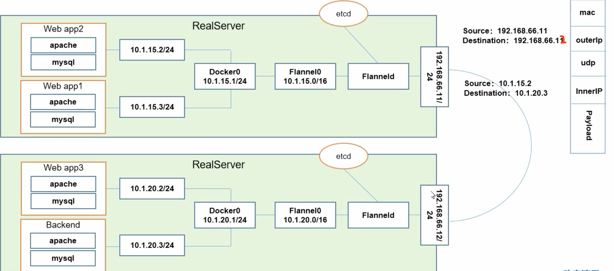

## 网络通信

### 容器间通信

同一个pod内的多个容器通信 --> loopback

### Pod间通信

Pod IP --> Pod IP

### Pod与Service通信

Pod IP --> Cluster IP

## CNI

### flannel

#### 概述

Flannel是CoreOS团队针对Kubernetes设计的一个网络规划服务，简单来说，它的功能是让集群中的不同节点主机创建的Docker容器都具有全集群唯一的虚拟IP地址。

在默认的Docker配置中，每个节点上的Docker服务会分别负责所在节点容器的IP分配。这样导致的一个问题是，不同节点上容器可能获得相同的内外IP地址。并使这些容器之间能够之间通过IP地址相互找到，也就是相互ping通。

Flannel的设计目的就是为集群中的所有节点重新规划IP地址的使用规则，从而使得不同节点上的容器能够获得“同属一个内网”且”不重复的”IP地址，并让属于不同节点上的容器能够直接通过内网IP通信。

Flannel实质上是一种“覆盖网络(overlaynetwork)”，也就是将TCP数据包装在另一种网络包里面进行路由转发和通信，目前已经支持udp、vxlan、host-gw、aws-vpc、gce和alloc路由等数据转发方式，默认的节点间数据通信方式是vxlan转发。

#### 架构原理

架构图



组件说明：

`cni0`: 网桥设备，每创建一个pod都会创建一对veth pair。其中一端是pod中的eth0，另一端是Cni0网桥中的端口（网卡）。Pod中从网卡eth0发出的流量都会发送到Cni0网桥设备的端口（网卡）上。

```shell
cni0: flags=4163<UP,BROADCAST,RUNNING,MULTICAST>  mtu 1450
        inet 10.244.1.1  netmask 255.255.255.0  broadcast 0.0.0.0
        ether b2:a9:a5:49:30:d4  txqueuelen 1000  (Ethernet)
        RX packets 4090887  bytes 414788420 (395.5 MiB)
        RX errors 0  dropped 0  overruns 0  frame 0
        TX packets 4246318  bytes 632932469 (603.6 MiB)
        TX errors 0  dropped 0 overruns 0  carrier 0  collisions 0
```
Cni0设备获得的ip地址是该节点分配到的网段的第一个地址。

`flannel.1`: overlay网络的设备，用来进行 vxlan 报文的处理（封包和解包）。不同node之间的Pod数据流量都从overlay设备以隧道的形式发送到对端。

```shell
flannel.1: flags=4163<UP,BROADCAST,RUNNING,MULTICAST>  mtu 1450
        inet 10.244.1.0  netmask 255.255.255.255  broadcast 0.0.0.0
        ether fa:76:b6:4b:d0:e4  txqueuelen 0  (Ethernet)
        RX packets 238270  bytes 44552183 (42.4 MiB)
        RX errors 0  dropped 0  overruns 0  frame 0
        TX packets 122520  bytes 20237358 (19.2 MiB)
        TX errors 0  dropped 0 overruns 0  carrier 0  collisions 0
```

`Flanneld`：flannel在每个主机中运行flanneld作为agent，它会为所在主机从集群的网络地址空间中，获取一个小的网段subnet，本主机内所有容器的IP地址都将从中分配。同时Flanneld监听K8s集群数据库，为flannel.1设备提供封装数据时必要的mac，ip等网络数据信息。

#### 同一Node的不同Pod之间通信

通过cni0网卡通信

#### 不同Node的Pod之间通信

1. pod中产生数据，根据pod的路由信息，将数据发送到cni0
2. Cni0根据节点的路由表，将数据发送到隧道设备flannel.1
3. Flannel.1查看数据包的目的ip，从flanneld获得对端隧道设备的必要信息，封装数据包。
4. Flannel.1将数据包发送到对端设备。对端节点的网卡接收到数据包，发现数据包为overlay数据包，解开外层封装，并发送内层封装到flannel.1设备。
5. Flannel.1设备查看数据包，根据路由表匹配，将数据发送给Cni0设备。
6. cni0匹配路由表，发送数据给网桥上对应的端口。

#### 查看配置信息

```shell
[root@master ~]# cat /run/flannel/subnet.env
FLANNEL_NETWORK=10.244.0.0/16
FLANNEL_SUBNET=10.244.0.1/24
FLANNEL_MTU=1450
FLANNEL_IPMASQ=true
```

```shell
[root@master ~]# kubectl describe cm kube-flannel-cfg -n kube-system
Name:         kube-flannel-cfg
Namespace:    kube-system
Labels:       app=flannel
              tier=node
Annotations:  kubectl.kubernetes.io/last-applied-configuration:
                {"apiVersion":"v1","data":{"cni-conf.json":"{\n  \"name\": \"cbr0\",\n  \"cniVersion\": \"0.3.1\",\n  \"plugins\": [\n    {\n      \"type\...

Data
====
cni-conf.json:
----
{
  "name": "cbr0",
  "cniVersion": "0.3.1",
  "plugins": [
    {
      "type": "flannel",
      "delegate": {
        "hairpinMode": true,
        "isDefaultGateway": true
      }
    },
    {
      "type": "portmap",
      "capabilities": {
        "portMappings": true
      }
    }
  ]
}

net-conf.json:
----
{
  "Network": "10.244.0.0/16",
  "Backend": {
    "Type": "vxlan"
  }
}

Events:  <none>
```

#### 参考
`https://www.cnblogs.com/goldsunshine/p/10740928.html`

### calico

### canel
