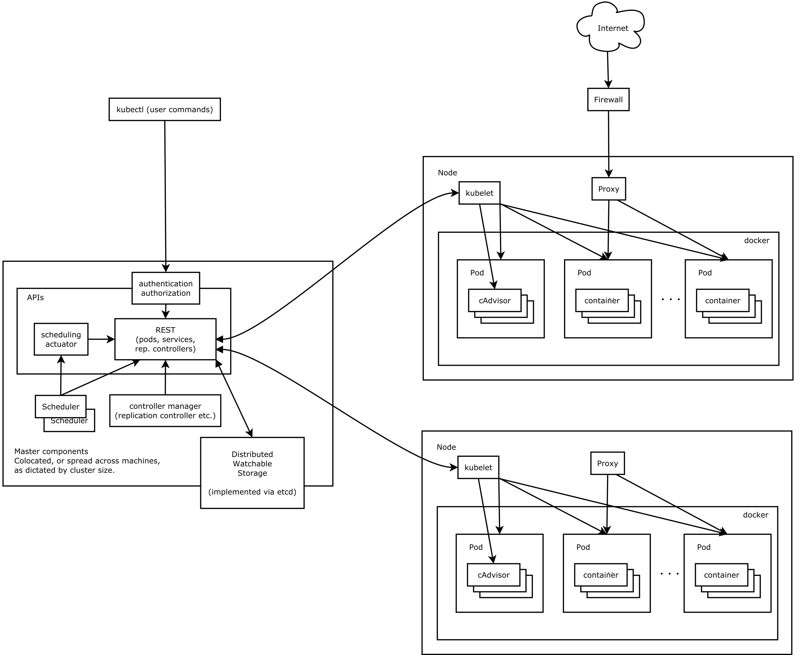

## 架构图

<h4>Kubernetes架构图</h4>

## 组件 | Components

### Master组件
Master组件提供的集群控制。Master组件对集群做出全局性决策（例如：调度），以及检测和响应集群事件（副本控制器的replicas字段不满足时,启动新的副本）。

#### kube-apiserver
kube-apiserver对外暴露了Kubernetes API。它是Kubernetes前端控制层。它被设计为水平扩展，即通过部署更多实例来缩放

#### etcd
etcd用于Kubernetes的后端存储。所有集群数据都存储在此处

#### kube-scheduler
Pod调度器

#### kube-controller-manager
运行控制器，它们是处理集群中常规任务的后台线程。逻辑上，每个控制器是一个单独的进程，但为了降低复杂性，它们都被编译成独立的可执行文件，并在单个进程中运行。

这些控制器包括:
  * Node Controller： 当节点移除时，负责注意和响应。
  * Replication Controller：负责维护系统中每个副本控制器对象正确数量的 Pod。
  * Endpoints Controller：填充端点（Endpoints）对象（即连接 Services & Pods）。
  * Service Account & Token Controllers：为新的命名空间创建默认帐户和 API 访问令牌。

### Node组件
运行在每个node上面，维护运行的pod和提供k8s运行环境

#### kubelet
kubelet是主要的节点代理,它监测已分配给其节点的Pod（通过apiserver或通过本地配置文件）提供如下功能:
  * 挂载Pod所需要的数据卷（Volume）。
  * 下载Pod的secrets。
  * 通过Docker运行（或通过rkt）Pod的容器。
  * 周期性的对容器生命周期进行探测。
  * 如果需要，通过创建镜像Pod（Mirror Pod）将Pod的状态报告回系统的其余部分。
  * 将节点的状态报告回系统的其余部分。

#### kube-proxy
网络转发代理，维护node节点的网络规则

#### Container Runtime
docker 。。。

### Addons（插件）
插件是实现集群功能的Pod和Service。Pods可以通过Deployments，ReplicationControllers管理。插件对象本身是受命名空间限制的，被创建于kube-system 命名空间。

#### DNS
为k8s服务提供DNS记录。

#### Dashboard
k8s仪表盘

#### Container Resource Monitoring
容器监控

#### Cluster-level Logging
日志

