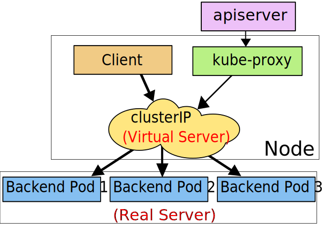

## Service
将运行在一组Pod上的应用程序公开为网络服务的抽象方法

### 定义Service
Service在k8s中是REST对象，与Pod一样。你可以通过POST请求API server来创建新的service实例

例子：定义一个名为`my-service`的service关联`MyApp`这个Pod
```yaml
apiVersion: v1
kind: Service
metadata:
  name: myhttp-v2-service
spec:
  selector:
    app: myhttp-v2
  type: NodePort
  ports:
    - protocol: TCP
      port: 8800
      targetPort: 80
      nodePort: 30080
```
创建服务

  `kubectl create -f ./myhttp-v2-service.yaml`

`svc.spec.type`

默认type为ClusterIP

`svc.spec.ports.nodePort`

端口范围30000-32767 不指定为范围内随机值

`svc.spec.sessionAffinity`

session会话保持

`kubectl patch svc getip-service -p '{"spec":{"sessionAffinity":"ClientIP"}}'`

```shell
➜  ~ while true; do curl "http://172.188.2.71:30080/info"; echo; sleep 1; done
{"Code":0,"Msg":"success","IpInfo":[{"Ip":"10.244.2.3","Mac":"52:91:74:8a:ee:96"}]}
{"Code":0,"Msg":"success","IpInfo":[{"Ip":"10.244.2.3","Mac":"52:91:74:8a:ee:96"}]}
{"Code":0,"Msg":"success","IpInfo":[{"Ip":"10.244.2.3","Mac":"52:91:74:8a:ee:96"}]}
{"Code":0,"Msg":"success","IpInfo":[{"Ip":"10.244.2.3","Mac":"52:91:74:8a:ee:96"}]}
{"Code":0,"Msg":"success","IpInfo":[{"Ip":"10.244.2.3","Mac":"52:91:74:8a:ee:96"}]}
{"Code":0,"Msg":"success","IpInfo":[{"Ip":"10.244.2.3","Mac":"52:91:74:8a:ee:96"}]}
```

#### 没有selector的service
Services主要用来抽象访问Pod，但它们也可以用来访问其它类型的backends
- 外部的数据库集群
- Service指向另一个Namespace或其它集群的Service
- 您正在将workload迁移到k8s。在评估该方法时，您仅在k8s中运行一部分后端。

example:（创建一个连接集群外的服务）
```yaml
apiVersion: v1
kind: Service
metadata:
  name: external-service
spec:
  ports:
    - protocol: TCP
      port: 3307
      targetPort: 3307
```

因为这个服务没有`selector`，你需要手动指定到Endpoint的映射关系
```yaml
apiVersion: v1
kind: Endpoints
metadata:
  name: external-service
subsets:
  - addresses:
      - ip: 172.188.2.89
    ports:
      - port: 3307
```

**注意：endpoint IP地址不可以是loopback，link-local或者其它k8s集群的Services，因为kube-proxy不支持虚拟地址**

### 虚拟IP和service代理
在k8s集群中，每个Node运行一个`kube-proxy`进程。`kube-proxy`负责为`Services`实现了一种VIP（虚拟IP）的形式，而不是ExternalName的形式。

#### userspace代理模式
客户端访问service-ip（clusterIP）请求会先从用户态切换到内核的iptables，然后回到用户态kube-proxy，kube-proxy负责代理转发工作。每个service都会由kube-proxy在node节点上起一个随机的代理端口，iptables会捕获clusterIP上的端口（targetPort）流量重定向到代理端口，任何访问代理端口的流量都会被代理到service后端的一个Pod上，默认情况下，对后端Pod的选择是轮询的。userspace模式，所有的转发都是通过 kube-proxy 软件来实现


#### iptables代理模式（默认模式）
客户端访问service-ip (clusterIP) 请求会由iptables直接重定向到后端对应的Pod上，每个service都会由kube-proxy生成对应iptables规则，iptables会捕获clusterIP上的端口（targetPort）流量重定向到后端的一个Pod上，默认情况下，对后端Pod的选择是随机的，也可以设置会话保持。iptables模式，所有的转发都是通过iptables内核模块来实现的，而kube-proxy只负责生成相应的iptables规则。


#### IPVS代理模式
从k8s 1.8版本之后，新增kube-proxy对ipvs的支持，并且在新版本的k8s 1.11版本中被纳入GA。之所以会有ipvs这种模式，是因为iptables添加规则是不增量的，先把当前的iptables规则都拷贝出现，再做修改，然后再把修改后的iptables规则保存回去，这样一个过程的结果就是，iptables在更新一条规则时，会把iptables锁住，这样的结果在服务数量达到一定量级时，性能基本上是不可接受的。

[IPVS详细介绍](https://www.codercto.com/a/20391.html)


### 多端口Services
对于某些需要公开多个端口的服务，k8s允许在Service对象上配置多个端口定义。为服务使用多个端口时，必须提供所有端口名称，以使它们无歧义。例如：
```yaml
apiVersion: v1
kind: Service
metadata:
  name: my-service
spec:
  selector:
    app: MyApp
  ports:
    - name: http
      protocol: TCP
      port: 80
      targetPort: 9376
    - name: https
      protocol: TCP
      port: 443
      targetPort: 9377
```

### 服务发现
k8s支持2种服务发现，环境变量和DNS

#### 环境变量
当Pod运行在Node上，kubelet会为每个活跃的Service添加一组环境变量。它同时支持Docker links兼容变量（查看 makeLinkVariables）、简单的{SVCNAME}_SERVICE_HOST和{SVCNAME}_SERVICE_PORT变量，这里Service的名称需大写，横线被转换成下划线。

#### DNS
使用附加组件为Kubernetes集群设置DNS服务。支持群集的DNS服务器（例如CoreDNS）监视Kubernetes API中的新服务，并为每个服务创建一组DNS记录。如果在整个群集中都启用了DNS，则所有Pod都应该能够通过其DNS名称自动解析服务。

### Headless Services
有时不需要或不想要负载均衡，以及单独的Service IP。遇到这种情况，可以通过指定Cluster IP（spec.clusterIP）的值为"None"来创建Headless Service。

`getip-service-headless.yml`
```yaml
apiVersion: v1
kind: Service
metadata:
  name: getip-service-headless
spec:
  selector:
    app: getip
  clusterIP: None
  ports:
    - protocol: TCP
      port: 7070
      targetPort: 7080
```

```shell
[root@master deployment]# kubectl get pods -o wide -l app=getip
NAME                               READY   STATUS    RESTARTS   AGE   IP           NODE    NOMINATED NODE   READINESS GATES
getip-deployment-c6b88c56b-pks5t   1/1     Running   0          18h   10.244.1.3   node1   <none>           <none>
getip-deployment-c6b88c56b-s5k45   1/1     Running   0          18h   10.244.2.3   node2   <none>           <none>

[root@master deployment]# dig +short -t A getip-service-headless.default.svc.cluster.local. @10.244.0.3
10.244.1.3
10.244.2.3
```

### 发布服务
对一些应用（如Frontend）的某些部分，可能希望通过外部k8s集群外部IP地址暴露Service。

k8s`ServiceTypes`允许指定一个需要的类型的Service，默认是`ClusterIP`类型。

- `ClusterIP`: 通过集群的内部IP暴露服务，服务只能够在集群内部可以访问。
- `NodePort`: 通过每个Node上的IP和静态端口（NodePort）暴露服务。NodePort服务会路由到ClusterIP服务，这个ClusterIP服务会自动创建。通过请求NodeIP:NodePort，可以从集群的外部访问一个NodePort服务。
- `LoadBalancer`: 使用云提供商的负载局衡器，可以向外部暴露服务。
- `ExternalName`: 通过返回CNAME和它的值，可以将服务映射到externalName字段的内容（例如，foo.bar.example.com）。没有任何类型代理被创建。

## Ingress

### 概述
Ingress暴露了HTTP和HTTPS从集群外部到集群内部服务的路由，流量路由由Ingress资源中定义的规则决定
```
   internet
      |
  [ Ingress ]
  --|-----|--
  [ Services ]
```

### Ingress、Ingress Controller

- ingress

k8s中的一个api对象资源，定义请求如何转发到service的规则，可以理解为配置模版

- ingress-controller

具体实现反向代理和负载均衡的Pod，对ingress定义的规则进行解析，根据配置的规则来实现请求转发

### 部署模式

1. Deployment + LoadBalancer模式的Service

如果要把ingress部署在公有云，那用这种方式比较合适。用Deployment部署ingress-controller，创建一个type为       LoadBalancer的service关联这组pod。大部分公有云，都会为LoadBalancer的service自动创建一个负载均衡器，通常还绑定了公网地址。只要把域名解析指向该地址，就实现了集群服务的对外暴露。

2. Deployment + NodePort模式的Service

同样用deployment模式部署ingress-controller，并创建对应的服务，但是type为NodePort。这样ingress就会暴露在集群节 点ip的特定端口上。由于nodeport暴露的端口是随机端口，一般会在前面再搭建一套负载均衡器来转发请求。该方式一般用于宿主机是相对固定的环境ip地址不变的场景。NodePort方式暴露ingress虽然简单方便，但是NodePort多了一层NAT，在请求量级很大时可能对性能会有一定影响。

3. DaemonSet + HostNetwork + nodeSelector

用DaemonSet结合nodeselector来部署ingress-controller到特定的node上，然后使用HostNetwork直接把该pod与宿主机node的网络打通，直接使用宿主机的80/433端口就能访问服务。这时ingress-controller所在的node机器就很类似传统架构的边缘节点，比如机房入口的nginx服务器。该方式整个请求链路最简单，性能相对NodePort模式更好。缺点是由于直接利用宿主机节点的网络和端口，一个node只能部署一个ingress-controller pod。比较适合大并发的生产环境使用。

### ingress-nginx

版本：`0.28.0`

#### 部署模式2

```shell
[root@master ~]# wget https://raw.githubusercontent.com/kubernetes/ingress-nginx/master/deploy/static/mandatory.yaml
[root@master ~]# wget https://raw.githubusercontent.com/kubernetes/ingress-nginx/master/deploy/static/provider/baremetal/service-nodeport.yaml
```

创建ingress-controller, ingress-service
```shell
[root@master ~]# kubectl apply -f mandatory.yaml
[root@master ~]# kubectl apply -f service-nodeport.yaml
```

创建ingress资源
```yaml
apiVersion: extensions/v1beta1
kind: Ingress
metadata:
  name: ingress-http
  annotations:
    kubernetes.io/ingress.class: "nginx"
    # 开启use-regex，启用path的正则匹配
    nginx.ingress.kubernetes.io/use-regex: "true"
spec:
  rules:
    # 定义域名
    - host: www.tabops.com
      http:
        paths:
          - path: /
            backend:
              serviceName: getip-service
              servicePort: 80
    - host: www.pdd.com
      http:
        paths:
          - path: /
            backend:
              serviceName: myhttp-service
              servicePort: 80
```

查看状态
```shell
[root@master ingress]# kubectl get pods -o wide -n ingress-nginx
NAME                                        READY   STATUS    RESTARTS   AGE   IP           NODE    NOMINATED NODE   READINESS GATES
nginx-ingress-controller-657dfc89f9-qkk2b   1/1     Running   0          11m   10.244.2.8   node2   <none>           <none>
nginx-ingress-controller-657dfc89f9-z9prz   1/1     Running   0          11m   10.244.1.8   node1   <none>           <none>
[root@master ingress]# kubectl get svc -o wide -n ingress-nginx
NAME            TYPE       CLUSTER-IP      EXTERNAL-IP   PORT(S)                      AGE     SELECTOR
ingress-nginx   NodePort   10.108.202.19   <none>        80:30670/TCP,443:32229/TCP   7m41s   app.kubernetes.io/name=ingress-nginx,app.kubernetes.io/part-of=ingress-nginx
[root@master ingress]# kubectl get ingress -o wide
NAME           HOSTS                        ADDRESS         PORTS   AGE
ingress-http   www.tabops.com,www.pdd.com   10.108.202.19   80      8m59s
```

#### 部署模式3

DaemonSet部署在特定节点`node1`
```shell
[root@master ingress]# kubectl label node node1 isIngress="true"
```

修改mandatory.yaml文件配置项

1. Deployment -> DaemonSet

2. 删除Replicas

3. 选择对应node的标签

4. 启用hostNetwork

```yaml
kind: DaemonSet
  # replicas: 1
      nodeSelector:
        # kubernetes.io/os: linux
        isIngress: "true"
      hostNetwork: true
```


创建ingress-controller
```shell
[root@master ~]# kubectl apply -f mandatory.yaml
```

创建ingress资源

同上

查看状态

```shell
[root@master ingress]# kubectl get pods -o wide -n ingress-nginx
NAME                             READY   STATUS    RESTARTS   AGE     IP             NODE    NOMINATED NODE   READINESS GATES
nginx-ingress-controller-52qtj   1/1     Running   0          3h31m   172.188.2.86   node1   <none>           <none>
[root@master ingress]# kubectl get ingress -o wide
NAME           HOSTS                        ADDRESS          PORTS   AGE
ingress-http   www.tabops.com,www.pdd.com                    80      20m
```

### 参考

`https://www.cnblogs.com/linuxk/p/9706720.html`

`https://www.cnblogs.com/Presley-lpc/p/10923432.html`

`https://segmentfault.com/a/1190000019908991`