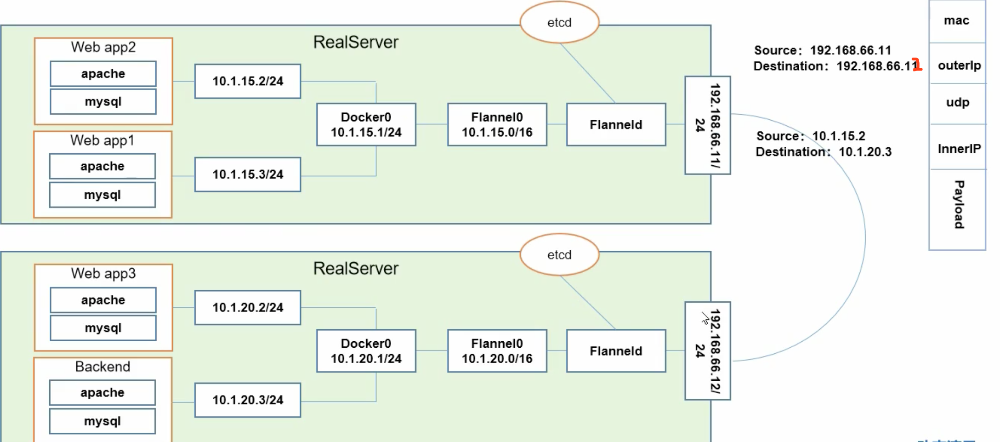

## 架构

&nbsp;

<h4>Kubernetes架构</h4>

### 组件
- apiserver: 所有服务访问统一入口
- controllermanager: 维护副本数目
- scheduler: 负责任务分发，选择合适的节点进行分配任务
- etcd: 键值数据库，存储k8s集群信息（持久化）
- kubelet: 容器生命周期管理
- kube-proxy: 负责写入规则至iptables, ipvs实现服务映射访问
- CoreDNS: 为SVC创建域名IP对应关系解析
- Ingress Controller: 实现7层代理（官方只提供4层代理）

## Pod
- 自主式Pod
- 控制器管理的Pod

### Pod控制器类型
- ReplicationController & ReplicaSet & Deployment
> HPA (HorizontalPodAutoScale)

&emsp;ReplicationController用来确保容器应用的副本数始终保持在用户定义的副本数，
即如果有容器异常退出，会自动创建新的Pod来替代，而如果异常多出来的容器也会自动回收。

&emsp;ReplicaSet在ReplicationController的基础上增加支持集合式selector

&emsp;Deployment在前面的基础上支持rolling-update（更新回滚）

&emsp;HorizontalPodAutoScale仅适用ReplicationController ReplicaSet 支持根据
Pod的cpu利用率，内存使用量扩容

- StatefullSet

&emsp;StatefullSet是为了解决有状态服务的问题（Deployments ReplicaSets无状态）

&emsp;1. 稳定的持久化存储，即Pod重新调度后还能访问到相同的持久化数据，基于PVC实现

&emsp;2. 稳定的网络标志，即Pod重新调度后其PodName和HostName不变，基于Headess
Service实现（没有Cluster IP的Service）

&emsp;3. 有序部署，有序扩展，即Pod是有顺序的，在部署或扩展的时候要依据定义的顺序依
进行（从0到N-1，在下一个Pod运行之前，所有前面的Pod必须都是Running和Ready状态）基于
init container实现

&emsp;4. 有序收缩，有序删除

- DaemonSet

&emsp;DaemonSet确保全部（除了污点）Node上运行一个Pod的副本。当有Node加入集群时，
也会为他们新增一个Pod。当有Node从集群移除时，这些Pod也会被回收。删除Daemonset将会
删除它创建的所有Pod

&emsp;使用DaemonSet的一些典型用法：

&emsp;1. 运行存储集群daemon, 例如在每个Node上运行glusterd、ceph

&emsp;2. 在每个Node上面运行日志收集daemon, 例如fluentd、logstash

&emsp;3. 在每个Node上面运行监控daemon, 例如Prometheus Node Exporter

- Job, Cronjob

&emsp;Job负责批处理任务，即仅执行一次的任务，它保证批处理任务的一个或多个Pod成功结束

&emsp;Cronjob管理基于时间的Job

## 网络

同一个Pod内多个容器之间：localhost (Container模式)

各Pod之间的通讯：Overlay Network (Flannel)

Pod与Service之间的通讯，iptables/ipvs

### Flannel
让集群中节点创建的容器都具有全集群唯一的虚拟IP地址。而且它还能在这些IP地址之间建立一个
覆盖网络（Overlay Network），通过这个覆盖网络将数据包原封不动的在各容器之间传递
**同一Node的不同Pod之间通过Docker0访问**

ETCD之Flannel提供说明：
1. 存储管理Flannel可分配的IP地址段资源
2. 监控ETCD中每个Pod的实际地址，并在内存中建立维护Pod节点路由表

## 安装
kubeadm config print init-defaults > kubeadm-config.yaml
kubeadm init --kubernetes-version=$(kubeadm version -o short)  --pod-network-cidr=10.244.0.0/16 --service-cidr=10.96.0.0/12 --ignore-preflight-errors=all
kubectl get pod -n kube-system
kubectl delete pod nginx-deploy-66ff98548d-95wcf
kubectl get deployment
kubectl describe pod nginx-pdd-fdc6f946f-82glf
kubectl logs -f nginx-pdd-fdc6f946f-82glf
kubectl run nginx-pdd --image=172.188.3.24:8000/library/nginx-pdd
kubectl scale --replicas=2 deployment/nginx-pdd
#### 创建service
kubectl expose deployment nginx-pdd --port 30000 --target-port=80
#### 外部访问
kubectl edit svc nginx-pdd
  type: ClusterIP -> NodePort

#### kube-proxy (默认iptables 可选用ipvs)

## 资源清单

### 集群资源分类
在k8s中、一般使用yaml格式的文件来创建符合我们预期期望的pod，这样的yaml文件我们一般
称为资源清单
1. 名称空间级别
  - 工作负载型资源（workload）：Pod、ReplicaSet、Deployment、StatefulSet、DaemonSet、
    Job、Cronjob
  - 服务发现及负载均衡型资源（ServiceDiscovery LoadBalance）：Service、Ingress、。。。
  - 配置与存储型资源：Volume（存储卷）、CSI（容器存储接口，可以扩展各种各样的第三方存储卷）
  - 特殊类型的存储卷：ConfigMap（当配置中心来使用的资源类型）、Secret（保存敏感数据）、
    DownwardAPI（把外部环境中的信息输出给容器）
2. 集群级别
  - Namespace、Node、Role、ClusterRole、RoleBinding、ClusterRoleBinding
3. 元数据级别
  - HPA、PodTemplate、LimitRange

## 容器生命周期

### Init容器
Pod能够具有多个容器，应用运行在容器里面，但是它也可能有一个或多个先于应用容器启动的Init容器
Init容器也准顺Pod的restartPolicy策略

  - Init总是运行到成功完成为止
  - 每个Init容器都必须在下一个Init容器启动之前成功完成

#### 作用
- 他们可以包含并运行实用工具，但是出于安全考虑，是不建议在应用程序容器镜像中包含这些实用工具
- 

# Pod