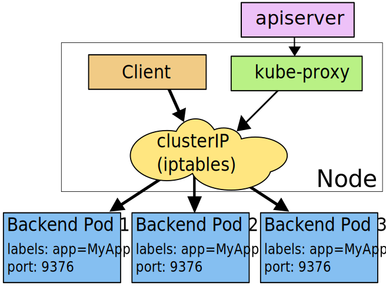

## Service
将运行在一组Pod上的应用程序公开为网络服务的抽象方法

### 定义Service
Service在k8s中是REST对象，与Pod一样。你可以通过POST请求API server来创建新的service实例

例子：定义一个名为`my-service`的service关联`MyApp`这个Pod
```yaml
apiVersion: v1
kind: Service
metadata:
  name: my-service
spec:
  selector:
    app: MyApp
  ports:
    - protocol: TCP
      port: 80
      targetPort: 9376
```

#### 没有selector的service
Services主要用来抽象访问Pod，但它们也可以用来访问其它类型的backends
- 外部的数据库集群
- Service指向另一个Namespace或其它集群的Service
- 您正在将workload迁移到k8s。在评估该方法时，您仅在k8s中运行一部分后端。

```yaml
apiVersion: v1
kind: Service
metadata:
  name: my-service
spec:
  ports:
    - protocol: TCP
      port: 80
      targetPort: 9376
```

因为这个服务没有`selector`，你需要手动指定到Endpoint的映射关系

```yaml
apiVersion: v1
kind: Endpoints
metadata:
  name: my-service
subsets:
  - addresses:
      - ip: 192.0.2.42
    ports:
      - port: 9376
```

**注意：endpoint IP地址不可以是loopback，link-local或者其它k8s集群的Services，因为kube-proxy不支持虚拟地址**

### 虚拟IP和service代理
在k8s集群中，每个Node运行一个`kube-proxy`进程。`kube-proxy`负责为`Services`实现了一种VIP（虚拟IP）的形式，而不是ExternalName的形式。

#### userspace代理模式
客户端访问service-ip（clusterIP）请求会先从用户态切换到内核的iptables，然后回到用户态kube-proxy，kube-proxy负责代理转发工作。每个service都会由kube-proxy在node节点上起一个随机的代理端口，iptables会捕获clusterIP上的端口（targetPort）流量重定向到代理端口，任何访问代理端口的流量都会被代理到service后端的一个Pod上，默认情况下，对后端Pod的选择是轮询的。userspace模式，所有的转发都是通过 kube-proxy 软件来实现


#### iptables代理模式
客户端访问service-ip (clusterIP) 请求会由iptables直接重定向到后端对应的Pod上，每个service都会由kube-proxy生成对应iptables规则，iptables会捕获clusterIP上的端口（targetPort）流量重定向到后端的一个Pod上，默认情况下，对后端Pod的选择是随机的，也可以设置会话保持。iptables模式，所有的转发都是通过iptables内核模块来实现的，而kube-proxy只负责生成相应的iptables规则。


#### IPVS代理模式
从k8s 1.8版本之后，新增kube-proxy对ipvs的支持，并且在新版本的k8s 1.11版本中被纳入GA。之所以会有ipvs这种模式，是因为iptables添加规则是不增量的，先把当前的iptables规则都拷贝出现，再做修改，然后再把修改后的iptables规则保存回去，这样一个过程的结果就是，iptables在更新一条规则时，会把iptables锁住，这样的结果在服务数量达到一定量级时，性能基本上是不可接受的。

IPVS详细介绍：`https://www.codercto.com/a/20391.html`


### 多端口Services
对于某些需要公开多个端口的服务，k8s允许在Service对象上配置多个端口定义。为服务使用多个端口时，必须提供所有端口名称，以使它们无歧义。例如：
```yaml
apiVersion: v1
kind: Service
metadata:
  name: my-service
spec:
  selector:
    app: MyApp
  ports:
    - name: http
      protocol: TCP
      port: 80
      targetPort: 9376
    - name: https
      protocol: TCP
      port: 443
      targetPort: 9377
```

### 服务发现
k8s支持2种服务发现，环境变量和DNS

#### 环境变量
当Pod运行在Node上，kubelet会为每个活跃的Service添加一组环境变量。它同时支持Docker links兼容变量（查看 makeLinkVariables）、简单的{SVCNAME}_SERVICE_HOST和{SVCNAME}_SERVICE_PORT变量，这里Service的名称需大写，横线被转换成下划线。

#### DNS
使用附加组件为Kubernetes集群设置DNS服务。支持群集的DNS服务器（例如CoreDNS）监视Kubernetes API中的新服务，并为每个服务创建一组DNS记录。如果在整个群集中都启用了DNS，则所有Pod都应该能够通过其DNS名称自动解析服务。

### Headless Services
有时不需要或不想要负载均衡，以及单独的Service IP。遇到这种情况，可以通过指定Cluster IP（spec.clusterIP）的值为"None"来创建 Headless Service。

### 发布服务
对一些应用（如Frontend）的某些部分，可能希望通过外部k8s集群外部IP地址暴露Service。

k8s`ServiceTypes`允许指定一个需要的类型的Service，默认是`ClusterIP`类型。

- `ClusterIP`: 通过集群的内部IP暴露服务，服务只能够在集群内部可以访问。
- `NodePort`: 通过每个Node上的IP和静态端口（NodePort）暴露服务。NodePort服务会路由到ClusterIP服务，这个ClusterIP服务会自动创建。通过请求NodeIP:NodePort，可以从集群的外部访问一个NodePort服务。
- `LoadBalancer`: 使用云提供商的负载局衡器，可以向外部暴露服务。
- `ExternalName`: 通过返回CNAME和它的值，可以将服务映射到externalName字段的内容（例如，foo.bar.example.com）。没有任何类型代理被创建。

## Ingress