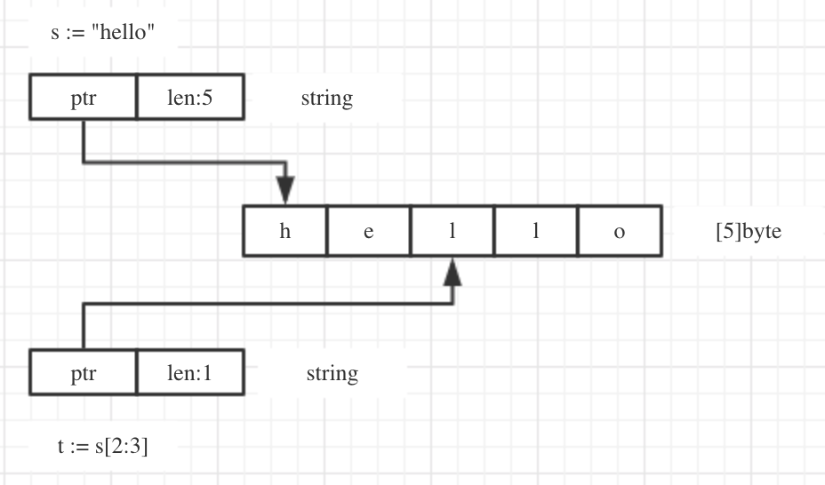

```go
bool

string

int  int8  int16  int32  int64
uint uint8 uint16 uint32 uint64 uintptr

byte // uint8 的别名 当要存储字符时选用byte

rune // int32 的别名
     // 代表一个Unicode码

float32 float64

complex64 complex128
```

example：查看数据类型和占用的字节数
```go
package main

import (
	"fmt"
	"unsafe"
)

func main()  {
	var n1 = 100
	var n2 int64 = 200
	fmt.Printf("n1的数据类型%T\n", n1)
	fmt.Printf("n2的数据类型%T，n2占用的字节数%d\n", n2, unsafe.Sizeof(n2))
}
```

```go
n1的数据类型int
n2的数据类型int64，n2占用的字节数8
```

## 整型

### 有符号整数类型
```go
int8    1字节 -2^7 ~ 2^7-1
int16   2字节 -2^15 ~ 2^15-1
int32   4字节 -2^31 ~ 2^31-1
int64   8字节 -2^63 ~ 2^63-1
int     32位系统为int32 64位系统为int64
```

### 无符号整数类型
```go
uint8   1字节 0 ~ 2^8-1
uint16  2字节 0 ~ 2^16-1
uint32  4字节 0 ~ 2^32-1
uint64  8字节 0 ~ 2^64-1
```

## 浮点数
浮点数都是有符号的，go的浮点型默认为float64
```go
float32 4字节
float64 8字节
```

## 字符类型
**Go中没有专门的字符类型**，如果要存储单个字符（字母），一般使用byte来保存

字符类型使用细节
1. 字符常量是用单引号（''）括起来的单个字符 var c1 byte = 'a'
2. go使用utf-8编码 英文字母一个字节，汉字三个字节
3. 字符可以进行运算

```go
package main

import "fmt"

func main()  {
	var c1 = 'a'
	var c2 = '0' // 字符串0
	// 当我们直接输出byte值，就是直接输出对应的字符的码值
	fmt.Println("c1=",c1, "c2=",c2)
	// 输出对应字符，需要使用格式化输出
	fmt.Printf("c1=%c c2=%c\n", c1, c2)
	// 数字转换成字符
	var c4 int = 22269
	fmt.Printf("c4=%c\n", c4)
	// 字符串可以进行运行，运算时按照码值
	var n1 = 10 + 'a' // 10 + 97 = 107
	fmt.Println("n1=", n1)
}
```

## 复数
```go
complex64 complex128
```

## 布尔型
1. bool类型数据只允许取值true和false

2. bool类型占一个字节

## 字符串

## 概念
一个字符串是一个**不可改变**的字节序列
1. 字符串一旦被赋值了，就不能改变

2. 字符串的2种表示方式 1）双引号：会识别转义字符 2）单引号：以字符串的原生形式输出，包括换行和特殊字符

### 字符串的内存布局
string的底层是一个byte数组



## 常量
常量表达式的值在编译期计算，而不是在运行期

## 基本数据类型转换
**Go中的数据类型不能自动转换，需要显示转换**

例子1：
```go
package main

import "fmt"

func main() {
	var i int32 = 100
	var n1 float32 = float32(i)
	var n2 int8 = int8(i)
	var n3 int64 = int64(i)
	fmt.Printf("i=%v n1=%v n2=%v n3=%v\n", i, n1, n2, n3)

	// 被转换的是变量存储的数据（值），变量本身的数据类型没有变化
	fmt.Printf("i type is %T\n", i)

	// 高精度 -> 低精度；高精度的值超过低精度值的范围，编译时不会出错，结果会按溢出处理
	var num1 int64 = 999999
	var num2 int8 = int8(num1)
	fmt.Println("num2=", num2)
}
```

例子2：
```go
package main

import (
	"fmt"
	"strconv"
)

func main()  {
	var num1 int = 99
	var num2 float64 = 23.456
	var b bool = true
	var mychar byte = 'c'
	var str string

	// fmt.Sprintf
	str = fmt.Sprintf("%d", num1)
	fmt.Printf("str type %T str=%q\n", str, str)

	str = fmt.Sprintf("%f", num2)
	fmt.Printf("str type %T str=%q\n", str, str)

	str = fmt.Sprintf("%t", b)
	fmt.Printf("str type %T str=%q\n", str, str)

	str = fmt.Sprintf("%c", mychar)
	fmt.Printf("str type %T str=%q\n", str, str)


	// strconv
	str = strconv.FormatInt(int64(num1), 10)
	fmt.Printf("str type %T str=%q\n", str, str)

	str = strconv.FormatFloat(num2, 'f', 10, 64)
	fmt.Printf("str type %T str=%q\n", str, str)

	str = strconv.FormatBool(b)
	fmt.Printf("str type %T str=%q\n", str, str)
}
```

例子3：
```go
package main

import (
	"fmt"
	"strconv"
)

func main()  {
	var str string = "true"
	var b bool
	b, _ = strconv.ParseBool(str)
	fmt.Printf("b type %T b=%v\n", b, b)

	var str2 string = "1234567890"
	var n1 int64
	var n2 int
	n1, _ = strconv.ParseInt(str2, 10, 64)
	n2 = int(n1)
	fmt.Printf("n1 type %T n1=%v\n", n1, n1)
	fmt.Printf("n2 type %T n2=%v\n", n2, n2)

	var str3 string = "123.456"
	var f1 float64
	f1, _ = strconv.ParseFloat(str3, 64)
	fmt.Printf("f1 type %T f1=%v\n", f1, f1)
}
```

例子4：
```go
package main

import (
	"fmt"
	"strconv"
)

func main()  {
	var str string = "true"
	var b bool
	b, _ = strconv.ParseBool(str)
	fmt.Printf("b type %T b=%v\n", b, b)

	var str2 string = "1234567890"
	var n1 int64
	var n2 int
	n1, _ = strconv.ParseInt(str2, 10, 64)
	n2 = int(n1)
	fmt.Printf("n1 type %T n1=%v\n", n1, n1)
	fmt.Printf("n2 type %T n2=%v\n", n2, n2)

	var str3 string = "123.456"
	var f1 float64
	f1, _ = strconv.ParseFloat(str3, 64)
	fmt.Printf("f1 type %T f1=%v\n", f1, f1)

	// string在做数据类型转换时，要确保string能转换成有效的数据，否则转换为默认值
	var str4 string = "hello"
	var n3 int64
	n3, _ = strconv.ParseInt(str4, 10, 64)
	fmt.Printf("n3 type %T n3=%v\n", n3, n3)
}
```