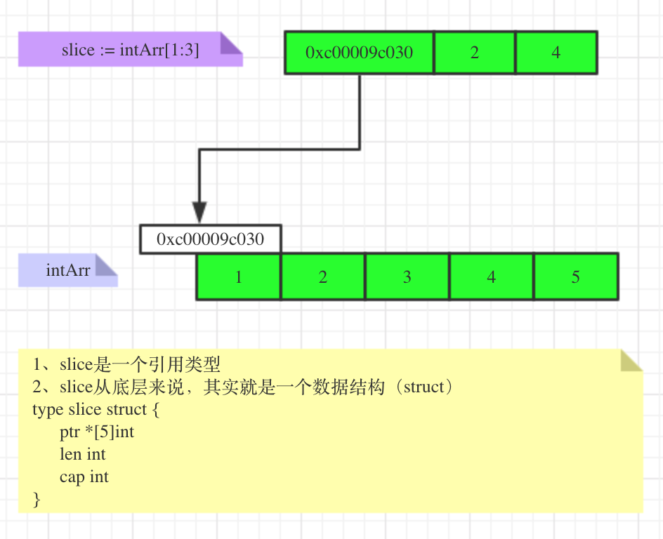

## 数组

### 概念
**数组是值类型**

数组是一个由固定长度的特定类型元素组成的序列，一个数组可以由零个或多个元素组成
```go
// 定义变量 `a` 是一个有十个整数的数组 默认情况下，数组的每个元素都被初始化为元素类型对应的零值
var a [10]int
```

```go
var q [3]int = [3]int{1, 2, 3}
var r [3]int = [3]int{1, 2}
fmt.Println(r[2]) // "0"
```

如果在数组的长度位置出现的是“...”省略号，则表示数组的长度是根据初始化值的个数来计算
```go
q := [...]int{1, 2, 3}
fmt.Printf("%T\n", q) // "[3]int"
```

数组的长度是数组类型的一个组成部分，因此[3]int和[4]int是两种不同的数组类型。数组的长度必须是常量表达式，因为数组的长度需要在编译阶段确定
```go
q := [3]int{1, 2, 3}
q = [4]int{1, 2, 3, 4} // compile error: cannot assign [4]int to [3]int
```

数组是值类型
```go
package main

import "fmt"

func modify(arr *[3]int)  {
	(*arr)[0] = 80
	arr[1] = 90 // 指针隐式解引用
	//arr++ go中没有指针运算
}

func main()  {
	var intArr [3]int = [3]int{10, 20, 30}
	modify(&intArr)
	fmt.Println("intArr=", intArr)
}
```

### 数组的内存布局
1. 数组地址可以通过数组名来获取 &数组名

2. 数组第一个元素的地址就是数组的地址

3. 数组各个元素的地址间隔是依据数组类型决定的，比如int64 -> 8字节，int32 -> 4字节 ...

```go
package main

import "fmt"

func main()  {
	var intArr [3]int
	fmt.Printf("intArr的地址=%p intArr[0]的地址=%p intArr[1]的地址=%p intArr[2]的地址=%p",
		&intArr, &intArr[0], &intArr[1], &intArr[2])
	// 为什么内存地址是一个字节加1，google内存最小寻址单位
}
```

```go
intArr的地址=0xc0000160e0 intArr[0]的地址=0xc0000160e0 intArr[1]的地址=0xc0000160e8 intArr[2]的地址=0xc0000160f0
```

### 遍历
常规遍历、for-range
```go
package main

import "fmt"

func main()  {
	var myArr [3]string = [3]string{"pdd", "pxx", "pbb"}

	for i := 0; i<len(myArr); i++ {
		fmt.Printf("%s\n", myArr[i])
	}
	// index, value名称自行定义
	for index, value := range myArr {
		fmt.Printf("下标=%d 值=%s\n", index, value)
	}
}
```

### 数组指针和指针数组
```go
package main

import "fmt"

func main(){
	x,y := 1, 2
	var arr =  [...]int{5:2}
	//数组指针
	var pf *[6]int = &arr

	//指针数组
	pfArr := [...]*int{&x,&y}
	fmt.Println(pf)
	fmt.Println(pfArr)
}
```

## 结构体
结构体是一种聚合的数据类型，是由零个或多个任意类型的值聚合成的实体

### 结构体字面值
结构体值也可以用结构体字面值表示，结构体字面值可以指定每个成员的值
```go
type Point struct{ X, Y int }
1. p := Point{1, 2}
2. p := Point{X:1, Y:2}
```

## 切片

### 概念

**切片是引用类型**

Slice（切片）代表变长的序列，序列中每个元素都有相同的类型。一个slice类型一般写作[]T，其中T代表slice中元素的类型；slice的语法和数组很像，只是没有固定长度而已，切片是数组的一个引用

```go
package main

import "fmt"

func main()  {
	var intArr [5]int = [...]int{1,2,3,4,5}
	slice := intArr[1:3]
	fmt.Println("intArr", intArr)
	fmt.Println("slice的元素", slice)
	fmt.Println("slice的元素个数", len(slice))
	fmt.Println("slice的容量", cap(slice))
}
```

内置的make函数创建一个指定元素类型、长度和容量的slice。容量部分可以省略，在这种情况下，容量将等于长度，未省略 cap >= len

```go
make([]T, len)
make([]T, len, cap) // same as make([]T, cap)[:len]
```

### 切片创建
通过make方式创建切片可以指定大小和容量，对应的数组由make底层维护，对外不可见，只能通过slice去访问各个元素
```go
package main

import "fmt"

func main()  {
	// 方式1
	var intArr1 [5]int = [...]int{1, 2, 3, 4, 5}
	slice1 := intArr1[1:3]
	fmt.Println("slice1", slice1)

	// 方式2
	var slice2 []int = make([]int, 5, 10)
	slice2[0] = 1
	slice2[1] = 2
	fmt.Println("slice2", slice2)

	// 方式3 使用原理类似make
	var slice3 []int = []int{1, 2, 3, 4, 5}
	fmt.Println("slice3", slice3)
}
```

### 切片的内存布局


### 切片扩容
append内置函数可以对切片进行动态追加

切片append操作的底层原理分析
```go
package main

import "fmt"

func main() {
	var intArr [5]int = [...]int{1, 2, 3, 4, 5}
	slice := intArr[0:2]
	fmt.Printf("数组地址=%p\n", &intArr)
	fmt.Printf("slice=%v len=%d cap=%d\n", slice, len(slice), cap(slice))
	fmt.Printf("数组地址=%p 切片地址=%p\n", slice, &slice)
	slice = append(slice, 6, 7)
	fmt.Printf("slice=%v len=%d cap=%d\n", slice, len(slice), cap(slice))
	fmt.Printf("数组地址=%p 切片地址=%p\n", slice, &slice)
	slice = append(slice, 8, 9)
	fmt.Printf("slice=%v len=%d cap=%d\n", slice, len(slice), cap(slice))
	fmt.Printf("数组地址=%p 切片地址=%p\n", slice, &slice)
}
```
```go
数组地址=0xc00009e030
slice=[1 2] len=2 cap=5
数组地址=0xc00009e030 切片地址=0xc000084020
slice=[1 2 6 7] len=4 cap=5
数组地址=0xc00009e030 切片地址=0xc000084020
slice=[1 2 6 7 8 9] len=6 cap=10
数组地址=0xc0000a8000 切片地址=0xc000084020
```
1. 切片append操作的本质就是对数组扩容

2. 如果扩容后的切片len不大于cap，就在数组上追加数据

3. 如果扩容后的切片len大于cap，go底层会创建一个新的数组newArr（扩容后大小），将切片原来包含的数据拷贝到新数组，追加数据，切片重新引用到新数组（newArr由底层维护，不可见）

### 切片拷贝
切片使用内置函数copy进行拷贝，copy(para1, para2): para1和para2都是**切片类型**
```go
package main

import "fmt"

func main()  {
	var slice1 []int = []int{1,2,3,4,5}
	var slice2 = make([]int, 10)
	var slice3 = make([]int, 1)
	copy(slice2, slice1)
	copy(slice3, slice1)
	fmt.Println("slice1=", slice1, "slice2", slice2, "slice3", slice3)
}
```
```go
slice1= [1 2 3 4 5] slice2 [1 2 3 4 5 0 0 0 0 0] slice3 [1]
```

### 切片和字符串
string底层是一个byte数组，因此string也可以进行切片处理
```go
package main

import "fmt"

func main()  {
	var s string = "hello"
	fmt.Printf("s地址=%p\n", &s)

	// string是不可变的，不能通过s[0] = 'p'方式来修改字符串
	// s[0] = 'p'

	// 切片方式修改字符串
	arr1 := []byte(s)
	arr1[0] = 'p'
	fmt.Printf("arr1=%s\n", arr1)
	s = string(arr1)
	fmt.Printf("s地址=%p\n", &s)
	fmt.Println("s=", s)

	arr2 := []rune(s)
	arr2[0] = '潘'
	fmt.Printf("arr2=%q\n", arr2)
	s = string(arr2)
	fmt.Printf("s地址=%p\n", &s)
	fmt.Println("s=", s)
}
```
```go
s地址=0xc000010200
arr1=pello
s地址=0xc000010200
s= pello
arr2=['潘' 'e' 'l' 'l' 'o']
s地址=0xc000010200
s= 潘ello
```

## Map

### 概述
map是引用类型
在Go语言中，一个map就是一个哈希表的引用，map类型可以写为map[K]V，其中K和V分别对应key和value。map中所有的key都有相同的类型，所有的value也有着相同的类型，但是key和value之间可以是不同的数据类型。**slice、map、function不可以作为key，因为这几个没法用==来判断**

map能动态增长键值对
```go
package main

import "fmt"

func main()  {
	var a map[string]string
	a = make(map[string]string, 2)

	a["no1"] = "jack"
	a["no2"] = "tom"
	a["no3"] = "alice"

	fmt.Println("a=", a)
}
```
```go
a= map[no1:jack no2:tom no3:alice]
```

### map创建
```go
// 声明map不会分配内存，初始化需要make分配内存后才能赋值和使用。数组区别：数组声明后，可以append数据
var a map[string]string
var a map[string]map[string]string

var a map[string]string
a = make(map[string]string, 10)
a["no1"] = "北京"
a["no2"] = "上海"
a["no3"] = "无锡"

ages := map[string]int{
    "alice":   31,
    "charlie": 34,
}

ages := make(map[string]int) // mapping from strings to ints
ages["alice"] = 31
ages["charlie"] = 34
```

### map增删改查

#### 增加，更新
```go
map["key"] = value // key不存在则增加，存在则修改
```

#### 删除
```go
// 单个key
delete(map, "key") // key存在则删除，key不存在也不会报错
// 所有key
// 1. 遍历key删除
// 2. map=make(...) make一个新的，让原来的成为垃圾，被GC回收
a = make(map[string]string)
```

#### 查找
```go
val, ok := a["no1"] // 存在返回true, 否则false
if ok {
	fmt.Printf("key no1存在%v\n", val)
} else {
	fmt.Printf("key no1不存在\n")
}
```

### map遍历
for-range
```go
for k,v := range a {
	fmt.Printf("k=%v v=%v", k, v)
}
```

### map切片
切片的数据类型如果是map，则称为slice of map，map切片
```go
package main

import "fmt"

func main()  {
	info := make([]map[string]string, 2)

	if info[0] == nil {
		info[0] = make(map[string]string, 2)
		info[0]["name"] = "小明"
		info[0]["sex"] = "male"
	}

	if info[1] == nil {
		info[1] = make(map[string]string, 2)
		info[1]["name"] = "小红"
		info[1]["sex"] = "female"
	}
	fmt.Println("info=", info)
}
```

### map排序
map的key默认是无序的，也没有专门的方法针对key排序
```go
package main

import (
	"fmt"
	"sort"
)

func main()  {

	info := map[string]int{
		"blick" : 18,
		"alice" : 17,
		"tom" : 16,
	}

	var slice []string
	for k, _ := range info {
		slice = append(slice, k)
	}
	sort.Strings(slice)

	for i :=0; i <= len(slice)-1; i++ {
		fmt.Printf("key=%s value=%d\n", slice[i], info[slice[i]])
	}
}
```
```go
key=alice value=17
key=blick value=18
key=tom value=16
```

## channel
管道

## 指针

### 使用细节
1. 值类型，都有对应的指针类型，形式为*数据类型，比如 *int *float
2. 值类型包括：基本数据类型 int系列，float系列，bool，string、数组和结构体（struct）

### 隐式解引用
对于一些复杂类型的指针， 如果要访问成员变量的话，需要写成类似`(*p).field`的形式，Go提供了隐式解引用特性，我们只需要`p.field`即可访问相应的成员

```go
p1 := &Person{name: "易天", age: 24}
fmt.Println((*p1).name)
fmt.Println(p1.name)
```

## 接口类型
interface

### error

## 值类型和引用类型
值类型：变量直接存储，变量通常在栈中分配

引用类型：变量存储的是一个地址、这个地址对应的空间存储数据（值），内存通常在堆上分配，当没有任何变量引用这个地址时，该地址对应的数据空间就成了一个垃圾，由GC来回收
