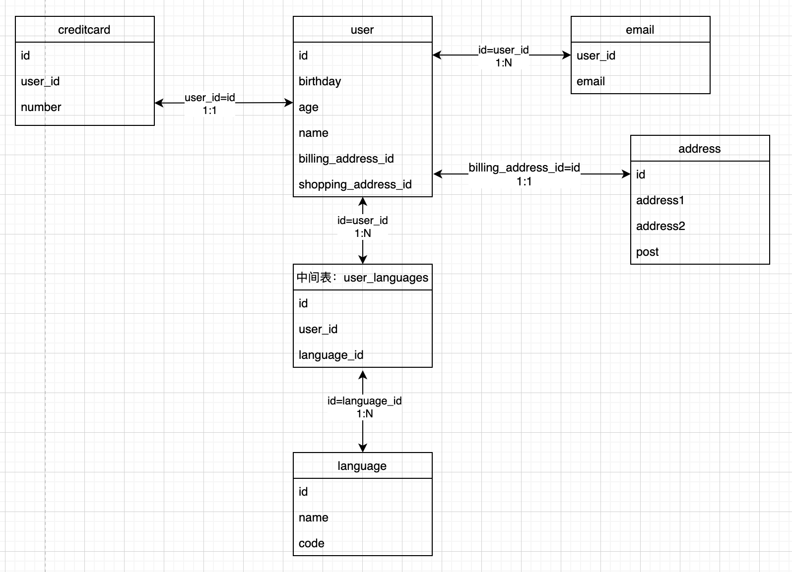

## 入门指南

### 声明模型

```go
type Cluster struct {
  global.ARSDN_MODEL
  Name         string      `gorm:"not null;unique;comment:'集群名称'"`
  CType        string      `gorm:"type:enum('master','slave');default:'master';comment:'主从类型'"`
  MasterIp     string      `gorm:"comment:'主集群IP'"`
  MasterPort   uint        `gorm:"comment:'主集群Port'"`
  MasterPass   string      `gorm:"type:varchar(2000);comment:'主集群密码'"`
  Desc         string      `gorm:"comment:'集群描述'"`
  SdnVersion   string      `gorm:"type:enum('arSdn_3.1', 'arSdn_3.2');comment:'SDN版本'"`
  BackendType  string      `gorm:"type:enum('KVM','VMware');comment:'后端集群类型'"`
  BackendIp    string      `gorm:"not null;unique;comment:'后端集群IP'"`
  BackendPort  uint        `gorm:"not null;comment:'后端集群端口'"`
  BackendUser  string      `gorm:"comment:'VMware账号'"`
  BackendPass  string      `gorm:"comment:'VMware密码'"`
  Network      Networks    `gorm:"not null;type:json;comment:'网络'"`
  Sdn          SDN         `gorm:"not null;type:json;comment:'SDN参数'"`
  Status       int         `gorm:"not null;comment:'集群状态'"`
  Hosts        []HostModel `gorm:"constraint:OnDelete:CASCADE;comment:'主机'"`
}
```

`Networks`、`SDN`是自定义数据类型，详情见自定义数据类型章节

## CRUD

### 创建

```go
user := User{Name: "Jinzhu", Age: 18, Birthday: time.Now()}

result := db.Create(&user) // 通过数据的指针来创建

user.ID             // 返回插入数据的主键
result.Error        // 返回 error
result.RowsAffected // 返回插入记录的条数
```

### 查询

#### 检索单个对象

GORM 提供了`First`、`Take`、`Last`方法，以便从数据库中检索单个对象。当查询数据库时它添加了`LIMIT 1`条件，且没有找到记录时，它会返回`ErrRecordNotFound`错误

```go
// 获取第一条记录（主键升序）
db.First(&user)
// SELECT * FROM users ORDER BY id LIMIT 1;

// 获取一条记录，没有指定排序字段
db.Take(&user)
// SELECT * FROM users LIMIT 1;

// 获取最后一条记录（主键降序）
db.Last(&user)
// SELECT * FROM users ORDER BY id DESC LIMIT 1;

result := db.First(&user)
result.RowsAffected // 返回找到的记录数
result.Error        // returns error or nil

// 检查 ErrRecordNotFound 错误
errors.Is(result.Error, gorm.ErrRecordNotFound)
```

#### 检索全部对象

```go
// 获取全部记录
var users []User
result := db.Find(&users)
// SELECT * FROM users;

result.RowsAffected // 返回找到的记录数，相当于 `len(users)`
result.Error        // returns error
```

### 更新

```go
db.Model(&Email{}).Where("id = ?", 2).Update("email", "plsof@qq.com")
```

### 删除

```go
db.Where("name = ?", "pdd").Delete(&email)
// DELETE from emails where id = 10 AND name = "pdd";
```

#### 软删除

如果你的模型里面包含`gorm.DeleteAt`（`gorm.Model`提供）字段，会执行软删除。

记录不会被删除，而是把`DeleteAt`字段设置为当前时间，Query请求的时候不会显示出这个字段。

`Unscoped`会执行物理的删除

```go
db.Unscoped().Delete(&order)
// DELETE FROM orders WHERE id=10;
```

#### 阻止全局删除

如果在没有任何条件的情况下执行批量删除，GORM 不会执行该操作，并返回 ErrMissingWhereClause 错误

对此，你必须加一些条件，或者使用原生 SQL，或者启用 AllowGlobalUpdate 模式，例如：

```go
db.Delete(&User{}).Error // gorm.ErrMissingWhereClause

db.Where("1 = 1").Delete(&User{})
// DELETE FROM `users` WHERE 1=1

db.Exec("DELETE FROM users")
// DELETE FROM users

db.Session(&gorm.Session{AllowGlobalUpdate: true}).Delete(&User{})
// DELETE FROM users
```

## 关联

### Belongs to

`belongs to`会与另一个模型建立了一对一的连接。这种模型的每一个实例都“属于”另一个模型的一个实例。

例如，您的应用包含 cluster 和 host，并且每个 host 能且只能被分配给一个 cluster。下面的类型就表示这种关系。注意，在`Host`对象中，有一个和`Cluster`一样的ClusterID。默认情况下，`ClusterID`被隐含地用来在`Host`和`Cluster`之间创建一个外键关系，因此必须包含在`Host`结构体中才能填充`Cluster`内部结构体。

```go
// Host 属于 Cluster，ClusterID是外键
type Host struct {
  gorm.Model
  HostName  string  `gorm:"column:hostname;not null;unique"`
  SshIp     string  `gorm:"not null;unique"`
  ClusterID uint    // 外键
  Cluster   Cluster
}

type Cluster struct {
  gorm.Model
  Name  string  `gorm:"not null;unique"`
}
```

### Has One

`has one`与另一个模型建立一对一的关联，但它和一对一关系有些许不同。这种关联表明一个模型的每个实例都包含或拥有另一个模型的一个实例。

例如，您的应用包含 cluster 和 host 模型，且每个 cluster 只能有一个 host。

```go
// Cluster有一个Host，ClusterID是外键
type Cluster struct {
  gorm.Model
  Name  string  `gorm:"not null;unique"`
  Host  Host    `gorm:"constraint:OnDelete:CASCADE"`
}

type Host struct {
  gorm.Model
  ClusterID uint    // 外键
  HostName  string  `gorm:"column:hostname;not null;unique"`
  SshIp     string  `gorm:"not null;unique"`
}
```

### Has Many

`has many`与另一个模型建立了一对多的连接。不同于`has one`，拥有者可以有零或多个关联模型。

例如，您的应用包含cluster和host模型，且每个cluster可以有多个host。

```go
// Cluster有多个Host，ClusterID是外键
type Cluster struct {
  gorm.Model
  Name  string  `gorm:"not null;unique"`
  Hosts []Host  `gorm:"constraint:OnDelete:CASCADE"`
}

type Host struct {
  gorm.Model
  ClusterID uint    // 外键
  HostName  string  `gorm:"column:hostname;not null;unique"`
  SshIp     string  `gorm:"not null;unique"`
}
```

### Many To Many

Example:

1. 数据结构

| 表1 | 表2 | 关联关系 |
| ---- | --- | -------- |
| user | address | belongs_to |
| user | email | has_many |
| user | creditcard | has_one |
| user | languages | many_to_many |



2. 代码

```go
package main

import (
  "fmt"
  "github.com/jinzhu/gorm"
  _ "github.com/jinzhu/gorm/dialects/mysql"
)

type User struct {
  ID                uint       `gorm:"primary_key"`
  Birthday          string     `gorm:"column:birthday"`
  Age               int        `gorm:"column:age"`
  Name              string     `gorm:"column:name"`
  BillingAddress    Address    `gorm:"foreignkey:BillingAddressId;"` // One-To-One (属于 - 本表的BillingAddressID作外键
  BillingAddressId  int        `gorm:"column:billing_address_id"`
  ShippingAddress   Address    `gorm:"foreignkey:ShippingAddressId;"` // One-To-One (属于 - 本表的ShippingAddressID作外键)
  ShippingAddressId int        `gorm:"column:shipping_address_id"`
  CreditCard        CreditCard `gorm:"foreignkey:UserID;"` // One-To-One (拥有一个 - CreditCard表的UserID作外键)
  Emails            []Email    `gorm:"ForeignKey:UserID;"`            // One-To-Many (拥有多个 - Email表的UserID作外键)
  Languages         []Language `gorm:"many2many:user_languages;"`     // Many-To-Many , 'user_languages'是连接表
}

type Email struct {
  ID     int    `gorm:"primary_key"`
  UserID int    `gorm:"column:user_id;"` // 外键 (属于), tag `index`是为该列创建索引
  Email  string `gorm:"column:email"`    // `type`设置sql类型, `unique_index` 为该列设置唯一索引
}

type Address struct {
  ID       int    `gorm:"primary_key"`
  Address1 string `gorm:"column:address1"` // 设置字段为非空并唯一
  Address2 string `gorm:"column:address2"`
  Post     string `gorm:"column:post"`
}

type Language struct {
  ID   int    `gorm:"primary_key"`
  Name string `gorm:"column:name"` // 创建索引并命名，如果找到其他相同名称的索引则创建组合索引
  Code string `gorm:"column:code"` // `unique_index` also works
}

type CreditCard struct {
  ID     int    `gorm:"primary_key"`
  UserID int    `gorm:"column:user_id;"`
  Number string `gorm:"column:number"`
}

func main() {
  db, err := gorm.Open("mysql", "root:21ysten123@(127.0.0.1)/gorm?charset=utf8&parseTime=True&loc=Local")
  if err != nil {
    panic(err)
  }
  defer db.Close()
  db.AutoMigrate(&User{},
    Email{},
    Address{},
    Language{},
    CreditCard{})

  var creditCard1 CreditCard
  creditCard1.ID = 1
  creditCard1.UserID = 1001
  creditCard1.Number = "1001PDD"

  var creditCard2 CreditCard
  creditCard2.ID = 2
  creditCard2.UserID = 1002
  creditCard2.Number = "1002PXX"

  var language1 Language
  language1.ID = 1
  language1.Name = "english"
  language1.Code = "101ENG"

  var language2 Language
  language2.ID = 2
  language2.Name = "chinese"
  language2.Code = "102CHI"

  languages := make([]Language, 2)
  languages[0] = language1
  languages[1] = language2

  var address Address
  address.ID = 1
  address.Address1 = "扬州市"
  address.Address2 = "无锡市"
  address.Post = "214000"

  var email1 Email
  email1.ID = 1
  email1.UserID = 11
  email1.Email = "254995740@qq.com"

  var email2 Email
  email2.ID = 2
  email2.UserID = 12
  email2.Email = "1103901630@qq.com"

  oEmails1 := make([]Email, 1)
  oEmails1[0] = email1

  oEmails2 := make([]Email, 1)
  oEmails2[0] = email2

  var user1 User
  user1.ID = 1
  user1.Birthday = "1029"
  user1.Age = 30
  user1.Name = "pdd"
  user1.BillingAddress = address
  user1.BillingAddressId = 1
  user1.ShippingAddress = address
  user1.ShippingAddressId = 2
  user1.CreditCard = creditCard1
  user1.Emails = oEmails1
  user1.Languages = languages

  var user2 User
  user2.ID = 2
  user2.Birthday = "1030"
  user2.Age = 30
  user2.Name = "pxx"
  user2.BillingAddress = address
  user2.BillingAddressId = 2
  user2.ShippingAddress = address
  user2.ShippingAddressId = 2
  user2.CreditCard = creditCard2
  user2.Emails = oEmails2
  user2.Languages = languages

  //插入数据
  //db.Create(&creditCard1)
  //db.Create(&creditCard2)
  //db.Create(&language1)
  //db.Create(&language2)
  //db.Create(&address)
  //db.Create(&email1)
  //db.Create(&email2)
  //db.Create(&user1)
  //db.Create(&user2)

  //删除数据
  //db.Delete(&user)

  //查询
  u := User{ID: 1}
  db.Model(&u).Debug().Find(&u)
  db.Model(&u).Debug().Related(&u.CreditCard,"CreditCard")
  db.Model(&u).Debug().Related(&u.Emails,"Emails")
  db.Model(&u).Debug().Related(&u.Languages, "Languages")
  db.Model(&u).Debug().Related(&u.BillingAddress,"BillingAddress")
  db.Model(&u).Debug().Related(&u.ShippingAddress,"ShippingAddress")
  fmt.Println(u)
}
```

```go
{1 1029 30 pdd {1 扬州市 无锡市 214000} 1 {1 扬州市 无锡市 214000} 1 {1 1 1001PDD} [{1 1 254995740@qq.com}] [{1 english 101ENG} {2 chinese 102CHI}]}
```

### 预加载

GORM 允许在 Preload 的其它 SQL 中直接加载关系，例如：

```go
// Cluster有多个Host，ClusterID是外键
type Cluster struct {
  gorm.Model
  Name  string  `gorm:"not null;unique"`
  Hosts []Host  `gorm:"constraint:OnDelete:CASCADE"`
}

type Host struct {
  gorm.Model
  ClusterID uint    // 外键
  HostName  string  `gorm:"column:hostname;not null;unique"`
  SshIp     string  `gorm:"not null;unique"`
}

// 查找 cluster 时预加载相关 host
db.Preload("Hosts").Find(&cluster)
// SELECT * FROM clusters;
// SELECT * FROM hosts WHERE cluster_id = 1;
```

## 自定义数据类型
