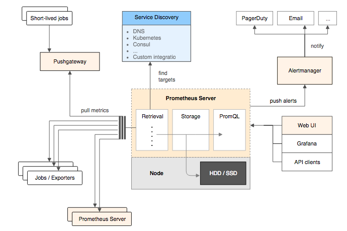

## 前介
 
### 部署

#### 下载，安装

二进制方式

```shell
wget https://github.com/prometheus/prometheus/releases/download/v2.14.0/prometheus-2.14.0.linux-amd64.tar.gz -C /data/server/
cd /data/server && tar -zxv -f prometheus-2.14.0.linux-amd64.tar.gz
ln -s prometheus-2.14.0.linux-amd64 prometheus
```

#### 启动脚本

`/etc/systemd/system/prometheus.service`
```yaml
[Unit]
Description=Prometheus Monitoring System
Documentation=Prometheus Monitoring System

[Service]
ExecStart=/data/server/prometheus/prometheus \
  --config.file=/data/server/prometheus/prometheus.yml \
  --web.listen-address=:9090

[Install]
WantedBy=multi-user.target
```

#### 启动

```shell
systemctl start prometheus
```

### 架构


<center>Prometheus架构</center>

#### Promethues server
Prometheus Server是Prometheus组件中的核心部分，负责实现对监控数据的获
取，存储以及查询。Prometheus Server可以通过静态配置管理监控目标，也可
以配合使用Service Discovery的方式动态管理监控目标，并从这些监控目标中获
取数据。其次Prometheus Server需要对采集到的监控数据进行存储，
Prometheus Server本身就是一个时序数据库，将采集到的监控数据按照时间序
列的方式存储在本地磁盘当中。最后Prometheus Server对外提供了自定义的
PromQL语言，实现对数据的查询以及分析。

#### Exporters
Exporter将监控数据采集的端点通过HTTP服务的形式暴露给Prometheus
Server，Prometheus Server通过访问该Exporter提供的Endpoint端点，即可获取
到需要采集的监控数据。

一般来说可以将Exporter分为2类：
  - 直接采集：这一类Exporter直接内置了对Prometheus监控的支持，比如
    cAdvisor，Kubernetes，Etcd，Gokit等，都直接内置了用于向Prometheus
    暴露监控数据的端点。
  - 间接采集：间接采集，原有监控目标并不直接支持Prometheus，因此我们需
    要通过Prometheus提供的Client Library编写该监控目标的监控采集程序。例
    如： Mysql Exporter，JMX Exporter，Consul Exporter等。

#### AlertManager
在Prometheus Server中支持基于PromQL创建告警规则，如果满足PromQL定义
的规则，则会产生一条告警，而告警的后续处理流程则由AlertManager进行管
理。在AlertManager中我们可以与邮件，Slack等等内置的通知方式进行集成，
也可以通过Webhook自定义告警处理方式。AlertManager即Prometheus体系中
的告警处理中心。

#### PushGateway
由于Prometheus数据采集基于Pull模型进行设计，因此在网络环境的配置上必须
要让Prometheus Server能够直接与Exporter进行通信。 当这种网络需求无法直
接满足时，就可以利用PushGateway来进行中转。可以通过PushGateway将内部
网络的监控数据主动Push到Gateway当中。而Prometheus Server则可以采用同
样Pull的方式从PushGateway中获取到监控数据。


## 探索PromQL

### 理解时间序列

Prometheus会将所有采集到的样本数据以时间序列（time-series）的方式保存在内存数据库中，并且定时保存到硬盘上。time-series是按照时间戳和值的序列顺序存放的，我们称之为向量(vector). 每条time-series通过指标名称(metrics name)和一组标签集(labelset)命名。如下所示，可以将time-series理解为一个以时间为Y轴的数字矩阵：

```shell
  ^
  │   . . . . . . . . . . . . . . . . .   . .   node_cpu{cpu="cpu0",mode="idle"}
  │     . . . . . . . . . . . . . . . . . . .   node_cpu{cpu="cpu0",mode="system"}
  │     . . . . . . . . . .   . . . . . . . .   node_load1{}
  │     . . . . . . . . . . . . . . . .   . .  
  v
    <------------------ 时间 ---------------->
```

在time-series中的每一个点称为一个样本（sample），样本由以下三部分组成：

+ 指标(metric)：metric name和描述当前样本特征的labelsets
+ 时间戳(timestamp)：一个精确到毫秒的时间戳
+ 样本值(value)： 一个float64的浮点型数据表示当前样本的值

```shell
<--------------- metric ---------------------><-timestamp -><-value->
http_request_total{status="200", method="GET"}@1434417560938 => 94355
http_request_total{status="200", method="GET"}@1434417561287 => 94334

http_request_total{status="404", method="GET"}@1434417560938 => 38473
http_request_total{status="404", method="GET"}@1434417561287 => 38544

http_request_total{status="200", method="POST"}@1434417560938 => 4748
http_request_total{status="200", method="POST"}@1434417561287 => 4785
```

### Metrics类型

1. Counter（计数器）
2. Gauge（仪表盘）
3. Histogram（直方图）
4. Summary（摘要）

#### Counter：只增不减的计数器

Counter类型的指标其工作方式和计数器一样，只增不减（除非系统发生重置）

#### Gauge：可增可减的仪表盘

Gauge类型的指标侧重于反应系统的当前状态。因此这类指标的样本数据可增可减

#### 使用Histogram和Summary分析数据分布情况

Histogram和Summary主用用于统计和分析样本的分布情况。*Histogram通过histogram_quantile函数是在服务器端计算分位数，而Sumamry的分位数则是直接在客户端计算完成*

`Summary`
```shell
# HELP prometheus_tsdb_wal_fsync_duration_seconds Duration of WAL fsync.
# TYPE prometheus_tsdb_wal_fsync_duration_seconds summary
prometheus_tsdb_wal_fsync_duration_seconds{quantile="0.5"} 0.012352463
prometheus_tsdb_wal_fsync_duration_seconds{quantile="0.9"} 0.014458005
prometheus_tsdb_wal_fsync_duration_seconds{quantile="0.99"} 0.017316173
prometheus_tsdb_wal_fsync_duration_seconds_sum 2.888716127000002
prometheus_tsdb_wal_fsync_duration_seconds_count 216
```

从上面的样本中可以得知当前Prometheus Server进行wal_fsync操作的总次数为216次，耗时2.888716127000002s。其中中位数（quantile=0.5）的耗时为0.012352463，9分位数（quantile=0.9）的耗时为0.014458005s （50%耗时<=0.012352463，90%耗时<=0.014458005）

`Histogram`
```shell
# HELP prometheus_tsdb_compaction_chunk_range Final time range of chunks on their first compaction
# TYPE prometheus_tsdb_compaction_chunk_range histogram
prometheus_tsdb_compaction_chunk_range_bucket{le="100"} 0
prometheus_tsdb_compaction_chunk_range_bucket{le="400"} 0
prometheus_tsdb_compaction_chunk_range_bucket{le="1600"} 0
prometheus_tsdb_compaction_chunk_range_bucket{le="6400"} 0
prometheus_tsdb_compaction_chunk_range_bucket{le="25600"} 0
prometheus_tsdb_compaction_chunk_range_bucket{le="102400"} 0
prometheus_tsdb_compaction_chunk_range_bucket{le="409600"} 0
prometheus_tsdb_compaction_chunk_range_bucket{le="1.6384e+06"} 260
prometheus_tsdb_compaction_chunk_range_bucket{le="6.5536e+06"} 780
prometheus_tsdb_compaction_chunk_range_bucket{le="2.62144e+07"} 780
prometheus_tsdb_compaction_chunk_range_bucket{le="+Inf"} 780
prometheus_tsdb_compaction_chunk_range_sum 1.1540798e+09
prometheus_tsdb_compaction_chunk_range_count 780
```

Histogram指标直接反应了在不同区间内样本的个数，区间通过标签len进行定义

### 初识PromQL

数据类型

`瞬时向量表达式，选择当前最新的数据`
```shell
http_request_total{}
```

`区间向量表达式，选择以当前时间为基准，5分钟内的数据`
```shell
http_request_total{}[5m]
```

`标量，标量只有一个数字，没有时序`
```shell
10
```

`字符串`
```shell
"this is a string"
```

### 聚合查询

统计各实例CPU非idle时间的使用率
```shell
sum(avg(irate(node_cpu_seconds_total{mode!="idle"}[5m])) without (cpu) ) by (instance)
```