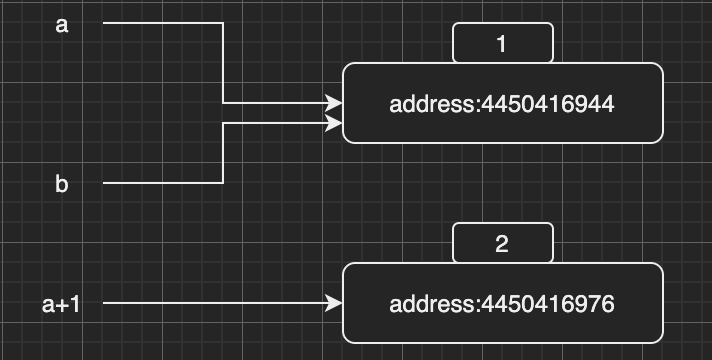
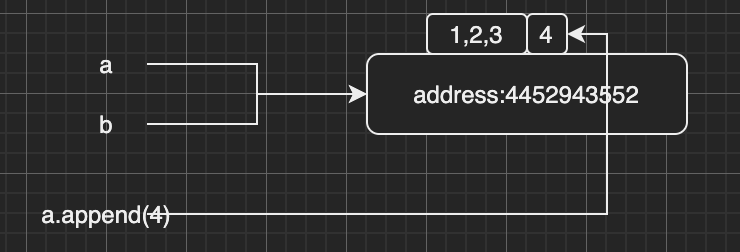

## 基础数据类型

### 整型

```shell
>>> a=1
>>> type(a)
<class 'int'>
```

### 浮点数

```shell
>>> a=1.0
>>> type(a)
<class 'float'>
```

### 布尔值

```shell
>>> a=False
>>> type(a)
<class 'bool'>
```

### 复数

```shell
>>> a=123-12j
>>> type(a)
<class 'complex'>
```

### 字符串

```shell
>>> a="hello world!"
>>> type(a)
<class 'str'>
```

### 元组

```shell
>>> a=(1,2,3)
>>> type(a)
<class 'tuple'>
```

### 列表

```shell
>>> a=[1,2,3]
>>> type(a)
<class 'list'>
```

### 字典

```shell
>>> a={'a':1, 'b':2, 'c':3}
>>> type(a)
<class 'dict'>
```

### 集合

```shell
>>> a={1,2,3}
>>> type(a)
<class 'set'>
```

### 可变与不可变数据

不可变数据类型：不支持原地修改。一旦修改，便是创建了一个新对象。
+ int
+ float
+ bool
+ string
+ tuple

```python
>>> a=1
>>> b=a
>>> id(a)
4450416944
>>> id(b)
4450416944
>>> a +=1
>>> id(a)
4450416976
>>> id(b)
4450416944
```

变量`a`变量`b`开始的时候指向同一个内存空间，因为`int`类型是不可变数据类型，变量`a`加1后指向了新的内存地址

内存分配情况如下：



可变数据类型：支持原地（in-place）修改。不改变原对象。
+ list
+ dict
+ set

```python
>>> a=[1,2,3]
>>> b=a
>>> id(a)
4452943552
>>> id(b)
4452943552
>>> a.append(4)
>>> id(a)
4452943552
>>> id(b)
4452943552
```

内存分配情况如下：



