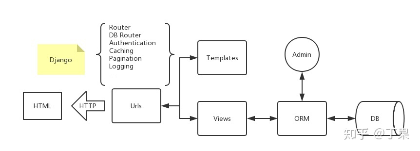
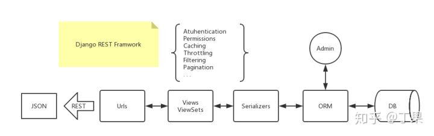
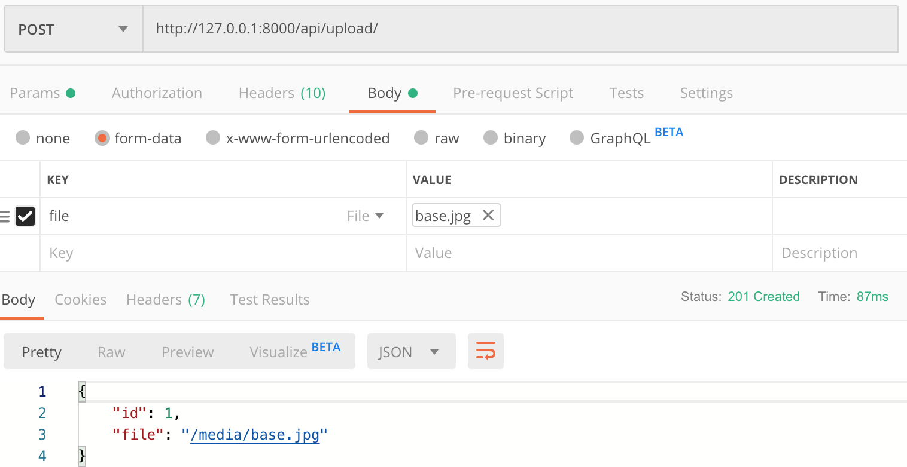

<center>
  <h1>Django Rest framework</h1>
</center>

##  Django vs DRF


<center>Django</center>

<center>Django REST Framwork</center>
## 基类

1、APIView (rest_framework.views.APIView)

在`APIView`中仍以常规的类视图定义方法来实现get() 、post() 或者其他请求方式的方法

`url(r'^books/$', views.BookListView.as_view())`

```python
from rest_framework.views import APIView
from rest_framework.response import Response

class BookListView(APIView):
		def get(self, request):
				books = BookInfo.objects.all()
				serializer = BookInfoSerializer(books, many=True)
				return Response(serializer.data)
```


2、GenericAPIView (rest_framework.generics.GenericAPIView)

继承自`APIVIew`，主要增加了操作序列化器和数据库查询的方法，作用是为下面Mixin扩展类的执行提供方法支持。通常在使用时，可搭配一个或多个Mixin扩展类

1. 提供的关于序列化器使用的属性与方法

   - 属性：
     
   - ***serializer_class*** 指明视图使用的序列化器
     
   - 方法：

     - ***get_serializer_class(self)***

       返回序列化器类，默认返回`serializer_class`，可以重写，例如：

       ​	def  get_serializer_class(self):

       ​			if self.request.user.is_staff:

       ​					return FullAccountSerializer

       ​			return BasicAccountSerializer

     - ***get_serializer(self, \*args, \*\*kwargs)***

       返回序列化器对象，主要用来提供给Mixin扩展类使用，如果我们在视图中想要获取序列化器对象，也可以直接调用此方法。

       注意，该方法在提供序列化器对象的时候，会向序列化器对象的context属性补充三个数据：request、format、view，这三个数据对象可以在定义序列化器时使用。

       - request 当前视图的请求对象
       - view 当前请求的类视图对象
       - format 当前请求期望返回的数据格式

2. 提供的关于数据库查询的属性与方法

   - 属性：

     - ***queryset*** 指明使用的数据查询集

   - 方法：

     - ***get_queryset(self)***

       返回视图使用的查询集，主要用来提供给Mixin扩展类使用，是列表视图与详情视图获取数据的基础，默认返回`queryset`属性，可以重写，例如：

       ​	def get_queryset(self):

       ​			user = self.request.user

       ​			return user.accounts.all()

     - ***get_object(self)***

       返回详情视图所需的模型类数据对象，主要用来提供给Mixin扩展类使用。

       在视图中可以调用该方法获取详情信息的模型类对象。

       若详情访问的模型类对象不存在，会返回404。

       该方法会默认使用APIView提供的check_object_permissions方法检查当前对象是否有权限被访问。

       ```python
       # url(r'^books/(?P<pk>\d+)/$', views.BookDetailView.as_view())
       class BookDetailView(GenericAPIView):
         	queryset = BookInfo.objects.all()
           serializer_class = BookInfoSerializer
           def get(self, request, pk):
             	book = self.get_object() # get_object()方法根据pk参数查找queryset中的数据对象
               serializer = self.get_serializer(book)
               return Response(serializer.data)
       ```

3. 其他可以设置的属性

   - ***pagination_class*** 指明分页控制类
   - ***filter_backends*** 指明过滤控制后端


## 扩展类

1、ListModelMixin

提供`list(request, *args, **kwargs)`方法快速实现列表视图，返回200状态码，该Mixin的list方法会对数据进行过滤和分页

```python
# 源代码
class ListModelMixin(object):
  	"""
  	List a queryset.
  	"""
    def list(self, request, *args, **kwargs):
    		# 过滤
    		queryset = self.filter_queryset(self.get_queryset())
    		# 分页
    		page = self.paginate_queryset(queryset)
    		if page is not None:
        		serializer = self.get_serializer(page, many=True)
          	return self.get_paginated_response(serializer.data)
        # 序列化
        serializer = self.get_serializer(queryset, many=True)
        return Response(serializer.data)
      
# example
from rest_framework.mixins import ListModelMixin
from rest_framework.generics import GenericAPIView

class BookListView(ListModelMixin, GenericAPIView):
  	queryset = BookInfo.objects.all()
    serializer_class = BookInfoSerializer
    def get(self, request):
      	return self.list(request)
```


2、CreateModelMixin

创建视图扩展类，提供`create(request, *args, **kwargs)`方法快速实现创建资源的视图，成功返回201状态码

如果序列化器对前端发送的数据验证失败，返回400错误

```python
# 源代码
class CreateModelMixin(object):
  	"""
  	Create a model instance
  	"""
    def create(self, request, *args, **kwargs):
      	# 获取序列化器
        serializer = self.get_serializer(data=request.data)
        # 验证
        serializer.is_valid(raise_exception=True)
        # 保持
        self.perform_create(serializer)
        headers = self.get_success_headers(serializer.data)
        return Response(serializer.data, status=status.HTTP_201_CREATED, headers=headers)
    def perform_create(self, serializer):
      	serializer.save()
    def get_success_headers(self, data):
      	try:
          	return {'Location': str(data[api_settings.URL_FIELD_NAME])}
        except (TypeError, KeyError):
          	return {}
```


3、RetrieveModelMixin

详情视图扩展类，提供`retrieve(request, *args, **kwargs)`方法，可以快速实现返回一个存在的数据对象

如果存在，返回200， 否则返回404

```python
源码
class RetrieveModelMixin(object):
  	"""
  	Retrieve a model instance
  	"""
    def retrieve(self, request, *args, **kwargs):
    		# 获取对象，会检查对象的权限
        instance = self.get_object()
        # 序列化
        serializer = self.get_serializer(instance)
				return Response(serializer.data)
      
# example
class BookDetailView(RetrieveModelMixin, GenericAPIView):
  	queryset = BookInfo.objects.all()
    serializer_class = BookInfoSerializer
    def get(self, request, pk):
      	return self.retrieve(request)
```


4、UpdateModelMixin

更新视图扩展类，提供`update(request, *args, **kwargs)`方法，可以快速实现更新一个存在的数据对象

同时也提供`partial_update(request, *args, **kwargs)`方法，可以实现局部更新

成功返回200，序列化器校验数据失败时，返回400错误

```python
# 源代码
class UpdateModelMixin(object):
  	"""
  	Update a model instance
  	"""
    def update(self, request, *args, **kwargs):
      	partial = kwargs.pop('partial', False)
        instance = self.get_object()
        serializer = self.get_serializer(instance, data=request.data, partial=partial)
        serializer.is_valid(raise_exception=True)
        self.perform_update(serializer)
        if getattr(instance, '_prefetched_objects_cache', None):
          	instance._prefetched_objects_cache = {}
            return Response(serializer.data)
   	def perform_update(self, serializer):
      	serializer.save()
    def partial_update(self, request, *args, **kwargs):
      	kwargs['partial'] = True
        return self.update(request, *args, **kwargs)
```


5、DestroyModelMixin

删除视图扩展类，提供`destroy(request, *args, **kwargs)`方法，可以快速实现删除一个存在的数据对象

成功返回204，不存在返回404

```python
# 源代码
class DestroyModelMixin(object):
  	"""
  	Destroy a model instance
  	"""
    def destroy(self, request, *args, **kwargs):
      	instance = self.get_object()
        self.perform_destroy(instance)
        return Response(status=status.HTTP_204_NO_CONTENT)
    def perform_destroy(self, instance):
      	instance.delete()
```


## 子类视图

1、CreateAPIView

提供 post 方法，继承自： `GenericAPIView`、`CreateModelMixin`


2、ListAPIView

提供 get 方法，继承自：`GenericAPIView`、`ListModelMixin`


3、RetrieveAPIView

提供 get 方法，继承自: `GenericAPIView`、`RetrieveModelMixin`


4、DestoryAPIView

提供 delete 方法，继承自：`GenericAPIView`、`DestoryModelMixin`


5、UpdateAPIView

提供 put 和 patch 方法，继承自：`GenericAPIView`、`UpdateModelMixin`


6、RetrieveUpdateAPIView

提供 get、put、patch方法、继承自： `GenericAPIView`、`RetrieveModelMixin`、`UpdateModelMixin`


7、RetrieveUpdateDestoryAPIView

提供 get、put、patch、delete方法、继承自：`GenericAPIView`、`RetrieveModelMixin`、`UpdateModelMixin`、`DestoryModelMixin`


## 视图集

使用视图集ViewSet，可以将一系列逻辑相关的动作放到一个类中：

- list() 提供一组数据
- retrieve() 提供单个数据
- create() 创建数据
- update() 保存数据
- destory() 删除数据

ViewSet视图集类不再实现get()、post()等方法，而是实现动作**action**如 list() 、create() 等

视图集只在使用as_view()方法的时候，才会将**action**动作与具体请求方式对应上

```python
# 路由
urlpatterns = [
		url(r'^books/$', BookInfoViewSet.as_view({'get':'list'}),
		url(r'^books/(?P<pk>\d+)/$', BookInfoViewSet.as_view({'get': 'retrieve'})
]

class BookInfoViewSet(viewsets.ViewSet):
  	def list(self, request):
      	books = BookInfo.objects.all()
        serializer = BookInfoSerializer(books, many=True)
        return Response(serializer.data)
    def retrieve(self, request, pk=None):
      	try:
        		books = BookInfo.objects.get(id=pk)
        except BookInfo.DoesNotExist:
          	return Response(status=status.HTTP_404_NOT_FOUND)
        serializer = BookInfoSerializer(books)
        		return Response(serializer.data)
```


## 自定义返回格式

### 默认response

#### views.py

```python
from rest_framework.generics import ListAPIView
from .serializer import IdcSerializer
from .models import Idc

class IdcList(ListAPIView):
    queryset = Idc.objects.all()
    serializer_class = IdcAllSerializer
```

#### response

```shell
➜  ~ curl -s 'http://127.0.0.1:8000/api/asset/idc' | python3 -m json.tool
[
    {
        "id": 2,
        "name": "109",
        "address": "成都",
        "isp": 0,
        "bandwidth": "",
        "ip_range": null,
        "comment": "",
        "isp_name": "移动"
    }
]
```

### 自定义response

实际开发中我们需要更多的返回字段 比如：

```json
{
  "code": 0,  # 状态码
  "data": [], # 存放数据
  "msg": "",  # 返回信息
  "total": "" # 返回数据的数量
}
```

#### views.py

```python
from rest_framework.generics import ListAPIView
from rest_framework.response import Response
from .serializer import IdcSerializer
from .models import Idc


class ResponseInfo(object):
    def __init__(self, **args):
        self.response = {
            "code": args.get('code', 0),
            "data": args.get('data', []),
            "msg": args.get('msg', 'success'),
            'total': args.get('total', 0)
        }


class IdcList(ListAPIView):
    def __init__(self, **kwargs):
        self.response_format = ResponseInfo().response
        super(IdcList, self).__init__(**kwargs)

    def list(self, request):
        queryset = Idc.objects.all()
        serializer = IdcSerializer(queryset, many=True)
        self.response_format["code"] = 0
        self.response_format["data"] = serializer.data
        if not serializer.data:
            self.response_format["msg"] = "List empty"
        self.response_format["total"] = len(serializer.data)
        return Response(self.response_format)
```

#### response

```shell
➜  ~ curl -s 'http://127.0.0.1:8000/api/asset/idc' | python3 -m json.tool
{
    "code": 0,
    "data": [
        {
            "id": 2,
            "name": "109",
            "address": "成都",
            "isp": 0,
            "bandwidth": "",
            "ip_range": null,
            "comment": "",
            "isp_name": "移动"
        }
    ],
    "msg": "success",
    "total": 1
}
```


## 分页

### 设置

1. 写在settings.py

2. 自定义分页类

   ```python
   class MyPageNumber(PageNumberPagination):
       page_size = 20
       page_query_param = 'page'
       page_size_query_param = 'limit'
   ```

### 代码

#### views.py

```python
class FileUploadView(APIView):
    # permission_classes = [IsAdminUser]

    def __init__(self, **kwargs):
        self.response_format = ResponseInfo().response
        super(FileUploadView, self).__init__(**kwargs)

    def get(self, request, format=None):
        files = File.objects.all()
        serializer = FileSerializer(files, many=True)
        page = self.request.query_params.get('page', None)
        # 判断用户的请求是否需要分页
        if page is not None and page is not '':
            page_obj = MyPageNumber()
            page_data = page_obj.paginate_queryset(queryset=serializer.data, request=request, view=self)
            self.response_format["data"] = page_data
        else:
            self.response_format["data"] = serializer.data
        self.response_format["total"] = len(serializer.data)
        self.response_format["code"] = 0
        if not serializer.data:
            self.response_format["msg"] = "List empty"
        return Response(self.response_format)
```

### 测试

请求第一页的数据，每页20行

```shell
curl 'http://127.0.0.1:8000/api/upload?page=1&limit=20'
```


## 更新用户密码

更新用户的密码（系统自带的User表）提供用户名、新，旧密码字段

### 代码

#### serializers.py

```python
class ChangePasswordSerializer(serializers.Serializer):

    """
    Serializer for password change endpoint.
    """
    username = serializers.CharField(required=True)
    old_password = serializers.CharField(required=True)
    new_password = serializers.CharField(required=True)

```

#### views.py

```python
from django.contrib.auth.models import User
from rest_framework import status
from django.http import Http404
from rest_framework.generics import UpdateAPIView
from .serializers import ChangePasswordSerializer


class ChangePasswordView(UpdateAPIView):
    serializer_class = ChangePasswordSerializer
    # model = User

    def get_object(self, username):
        try:
            return User.objects.get(username=username)
        except User.DoesNotExist:
            raise Http404

    def update(self, request, *args, **kwargs):
        serializer = self.get_serializer(data=request.data)

        if serializer.is_valid():
            object = self.get_object(serializer.data.get("username"))
            # Check old password
            if not object.check_password(serializer.data.get("old_password")):
                return Response({"msg": "旧密码错误"}, status=status.HTTP_400_BAD_REQUEST)
            # set_password also hashes the password that the user will get
            newpass = serializer.data.get("new_password")
            if len(newpass) < 8:
                return Response({"msg": "新密码长度小于8"},status=status.HTTP_400_BAD_REQUEST)
            object.set_password(serializer.data.get("new_password"))
            object.save()
            return Response({"msg": "密码更新成功"}, status=status.HTTP_200_OK)
        return Response(serializer.errors, status=status.HTTP_400_BAD_REQUEST)
```

### 测试

```shell
➜  ~ curl -H "Content-Type:application/json" -X PUT 'http://127.0.0.1:8000/api/user/changepasswd/' -d '{"old_password":"21ysten123", "new_password":"qwertyui", "username": "pdd"}'
{"msg":"密码更新成功"}%
```


## 文件上传

上传文件，查看上传文件列表，删除上传文件

### 代码

#### models.py

```python
from django.db import models


class File(models.Model):
    file = models.FileField(blank=False, null=False)

    def __str__(self):
        return self.file.name

    class Meta:
        ordering = ['file']
        verbose_name = '文件上传'
        verbose_name_plural = verbose_name

```

#### serializers.py

```python
from rest_framework import serializers

from .models import File


class FileSerializer(serializers.ModelSerializer):

    class Meta:
        model = File
        fields = "__all__"

```

#### views.py

```python
from rest_framework.response import Response
from rest_framework.views import APIView
from rest_framework import status
from rest_framework.permissions import IsAdminUser

from common.views import ResponseInfo, MyPageNumber
from .models import File
from .serializers import FileSerializer


class FileUploadView(APIView):
    permission_classes = [IsAdminUser]

    def __init__(self, **kwargs):
        self.response_format = ResponseInfo().response
        super(FileUploadView, self).__init__(**kwargs)

    def get(self, request, format=None):
        files = File.objects.all()
        serializer = FileSerializer(files, many=True)
        page = self.request.query_params.get('page', None)
        if page is not None and page is not '':
            page_obj = MyPageNumber()
            page_data = page_obj.paginate_queryset(queryset=serializer.data, request=request, view=self)
            self.response_format["data"] = page_data
        else:
            self.response_format["data"] = serializer.data
        self.response_format["total"] = len(serializer.data)
        self.response_format["code"] = 0
        if not serializer.data:
            self.response_format["msg"] = "List empty"
        return Response(self.response_format)

    def post(self, request, format=None):

        serializer = FileSerializer(data=request.data)
        if serializer.is_valid():
            serializer.save()
            return Response(serializer.data, status=status.HTTP_201_CREATED)
        else:
            return Response(serializer.errors, status=status.HTTP_400_BAD_REQUEST)


class FileDetailView(APIView):
    permission_classes = [IsAdminUser]

    def get_object(self, pk):
        try:
            return File.objects.get(pk=pk)
        except File.DoesNotExist:
            raise status.HTTP_404_NOT_FOUND

    def delete(self, request, pk, format=None):
        file = self.get_object(pk)
        file.file.delete()  # 物理删除图片
        file.delete()  # 删除数据库记录
        return Response(status=status.HTTP_204_NO_CONTENT)

```

#### urls.py

```python
from django.urls import path

from .views import FileUploadView, FileDetailView

urlpatterns = [
    path(r'', FileUploadView.as_view()),
    path(r'<int:pk>/', FileDetailView.as_view()),
]

```

### 设置上传目录

实际部署的时候我们会设置上传目录为nginx的root目录（urls.py里面就不用设置了）

#### settings.py

```python
# upload image
MEDIA_URL = '/media/'
MEDIA_ROOT = os.path.join(BASE_DIR, 'media')
```

#### urls.py

```
from django.conf import settings
from django.conf.urls.static import static

urlpatterns += static(settings.MEDIA_URL, document_root=settings.MEDIA_ROOT)
```

### 测试

1. 上传

   

2. 查看上传文件列表

   ```shell
   ➜  ~ curl -s 'http://127.0.0.1:8000/api/upload/' | python3 -m json.tool
   {
       "code": 0,
       "data": [
           {
               "id": 1,
               "file": "/media/base.jpg"
           }
       ],
       "msg": "success",
       "total": 1
   }
   ```

3. 删除上传文件

   ```shell
   curl -X DELETE 'http://127.0.0.1:8000/api/upload/1/'
   ```

   